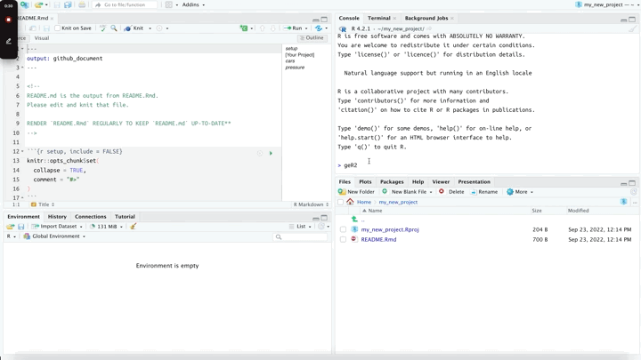

<!-- README.md is generated from README.Rmd. Please edit that file -->

```{r, include = FALSE}
knitr::opts_chunk$set(
  collapse = TRUE,
  comment = "#>",
  fig.path = "man/figures/README-",
  out.width = "100%"
)
```

# `geR2`: Good Enuff R (version 2!) 

<!-- badges: start -->
<!-- badges: end -->

The goal of `geR2` is to get you up and running with '[good enough practices!](https://journals.plos.org/ploscompbiol/article?id=10.1371/journal.pcbi.1005510)'

## Installation

You can install the development version of `geR2` like so:

``` r
install.packages("remotes")
remotes::install_github("mjfrigaard/ger2")
```

## Example

Create a new `ger2` project:

```{r example, eval=FALSE}
library(geR2)
ger2::ger_proj(parent_dir = "/Users/mjfrigaard/", 
  proj_name = "my new project")
```

```{r ger2-new-proj, echo=FALSE, eval=TRUE}
knitr::include_graphics("man/figures/ger2-new-proj.gif")
```

Run `ger2::ger_setup()` and start working! 

```{r ger2-setup, echo=FALSE, eval=TRUE}

```

