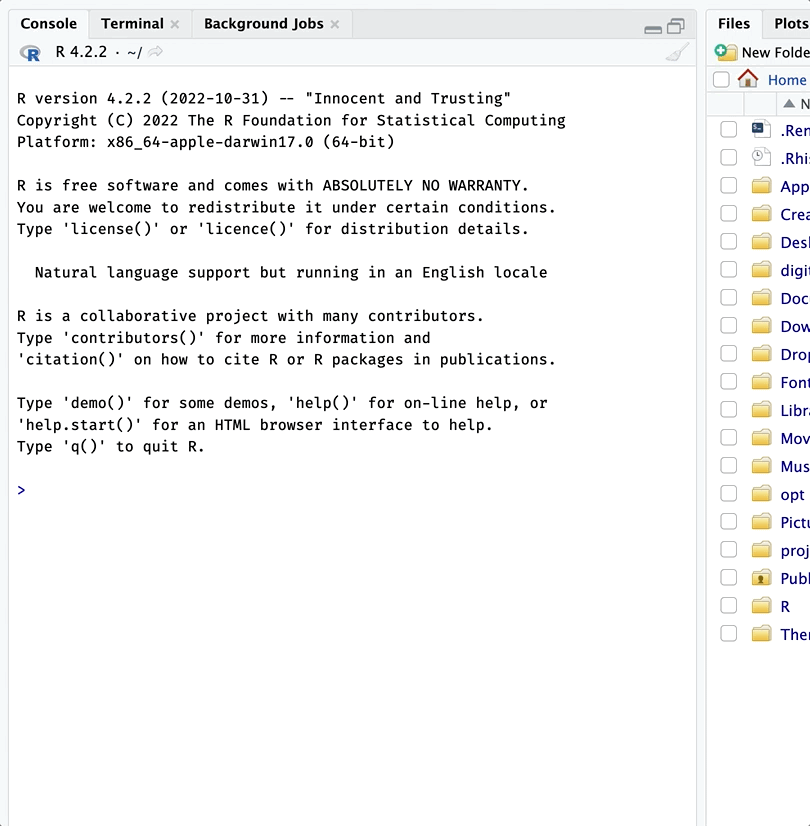

<!-- README.md is generated from README.Rmd. Please edit that file -->

# `gerp`: Good Enough R Practices

<!-- badges: start -->
<!-- badges: end -->

The goal of `gerp` is to get you up and running with ‘[good enough R
practices!](https://journals.plos.org/ploscompbiol/article?id=10.1371/journal.pcbi.1005510)’

## Installation

You can install the development version of `gerp` like so:

``` r
install.packages("remotes")
remotes::install_github("mjfrigaard/gerp")
```

## Example

Creating a new `gerp` project:

``` r
gerp::ger_proj(folder = "/Users/mjfrigaard/projects/", name = "my project")
```

<div class="figure" style="text-align: center">


<p class="caption">
New gerp project!
</p>

</div>
