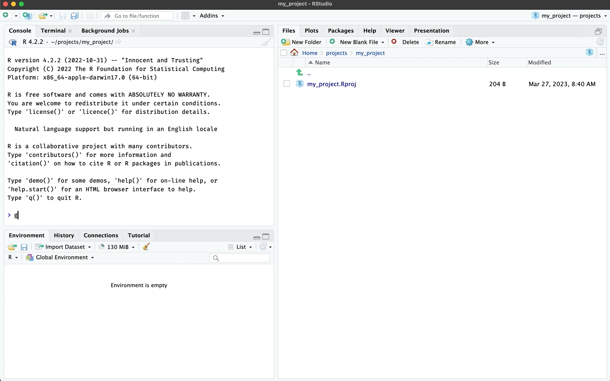
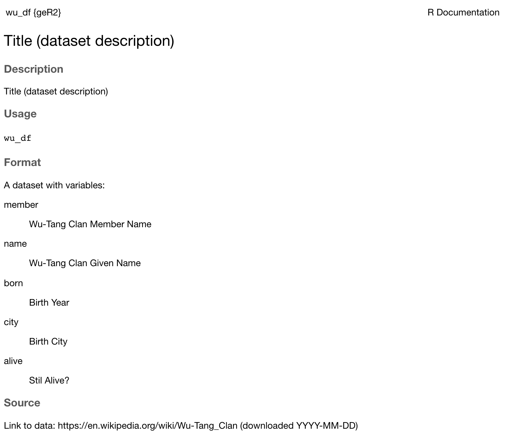
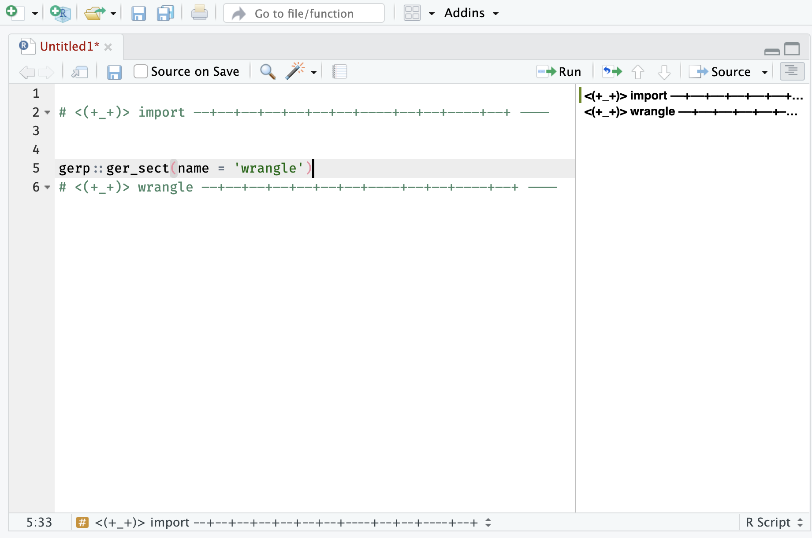

# Good enough code

``` r

library(gerp)
```

## `ger_code()`

Use
[`ger_code()`](https://mjfrigaard.github.io/gerp/reference/ger_code.md)
to create the `R/` code folder in your projects:



The
[`ger_code()`](https://mjfrigaard.github.io/gerp/reference/ger_code.md)
creates the following files:

``` r
R/
  ├── data.R
  ├── import.R
  ├── model.R
  ├── tidy.R
  ├── visualize.R
  └── wrangle.R
```

You can choose to have regular R script headers or `roxygen2` headers:

##### `roxygen = TRUE` (default)

``` r

#' @title 
#' 
#' 
#' @description
#' 
#' @details
#' 
#' @importFrom
#' 
#' @examples 
#' 
#'
```

##### `roxygen = FALSE`

``` r

#=====================================================================#
# This is code to create:
# Authored by and feedback to:
# MIT License
# Version:
#=====================================================================#
```

#### `R/data.R`

The `R/data.R` file should be used for documenting datasets in your
project. See example below:

``` r

#' Title (dataset description)
#'
#' @format A dataset with variables:
#' \describe{
#'   \item{member}{Wu-Tang Clan Member Name}
#'   \item{name}{Wu-Tang Clan Given Name}
#'   \item{born}{Birth Year}
#'   \item{city}{Birth City}
#'   \item{alive}{Stil Alive?}
#' }
#' @source Link to data: https://en.wikipedia.org/wiki/Wu-Tang_Clan
#' (downloaded YYYY-MM-DD)
'wu_df'
```

This will create the `.Rd` document so your dataset is accessible in the
**Help** pane.

  



## Headers

Even if you’re not using [`roxygen2`
tags](https://roxygen2.r-lib.org/articles/rd.html), it’s a good idea to
put a header on your code files. This helps collaborators (and you!)
track what the script does.

``` r

gerp::ger_headr()
#~~~~~~~~~~~~~~~~~~~~~~~~~~~~~~~~~~~~~~~~~~~~~~~~~~~~~~~~~~~~~~~~~~~~~#
# This is code to create:
# Authored by and feedback to:
# MIT License
# Version:
#~~~~~~~~~~~~~~~~~~~~~~~~~~~~~~~~~~~~~~~~~~~~~~~~~~~~~~~~~~~~~~~~~~~~~#
```

### Sections

[`gerp::ger_sect()`](https://mjfrigaard.github.io/gerp/reference/ger_sect.md)
will create a code section based on a `name` input:

``` r

gerp::ger_sect(name = 'import')
# <(+_+)> import ––+––+––+––+––+––+––+––––+––+––+––––+––+ ----
```

These are handy if you use RStudio’s outline feature:

  


