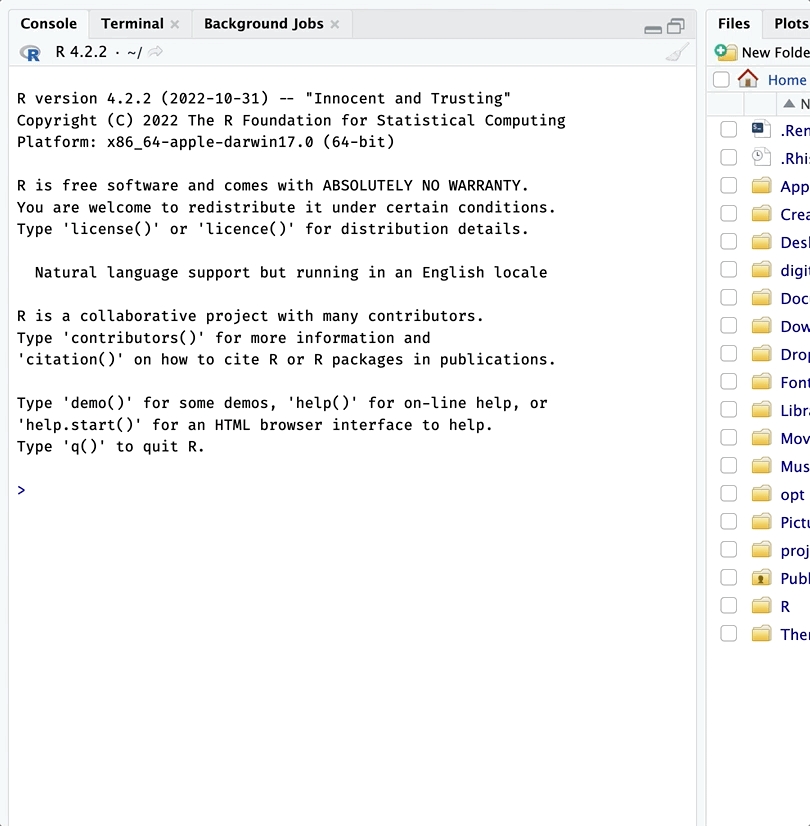

# create

``` r

library(gerp)
```

## Creating a `gerp` projects

Use
[`ger_create()`](https://mjfrigaard.github.io/gerp/reference/ger_create.md)
to create a new `gerp` project.

1.  First you need to install the package from GitHub.

``` r

install.packages("pak")
pak::pak("mjfrigaard/gerp")
```

2.  Pass the path to your new project folder to
    [`ger_create()`](https://mjfrigaard.github.io/gerp/reference/ger_create.md).
    The folder must not exist yet. If you need help locating a home for
    your R projects, check out the [Folder paths
    vignette](https://mjfrigaard.github.io/gerp/articles/paths.html).

  

``` r

gerp::ger_create("~/projects/my-project")
```

  

3.  After running
    [`gerp::ger_create()`](https://mjfrigaard.github.io/gerp/reference/ger_create.md),
    the new ‘good enough’ R project will open in a new RStudio or
    Positron session (set `open = FALSE` to stay in your current
    session):

  



New gerp project!

### `.Rproj` files

`gerp` projects use RStudio’s project files (with extension `.Rproj`).
`.Rproj` files [“contain project options and can also be used as a
shortcut for opening the project directly from the
filesystem.”](https://support.posit.co/hc/en-us/articles/200526207-Using-RStudio-Projects).([2](https://support.posit.co/hc/en-us/articles/200534477))

  

In Positron, use **File \> Open Folder** to re-open a project. When I
want to re-open my RStudio project, I navigate to the `.Rproj` file and
double-click on it to open RStudio:

  


Opening an RStudio project

------------------------------------------------------------------------

1.  Positron doesn’t need the `.Rproj` file (open the project folder
    instead), but it’s harmless to keep it.

2.  If you’re already using a cloud platform like
    [Dropbox](https://www.dropbox.com/) or [Google
    Drive](https://www.google.com/drive/) to keep track of your files,
    choose a different location for your R project folders. Cloud
    storage services are great, but they’ve been known to [cause
    issues](https://support.posit.co/hc/en-us/articles/200534477) when
    working with R and RStudio.
