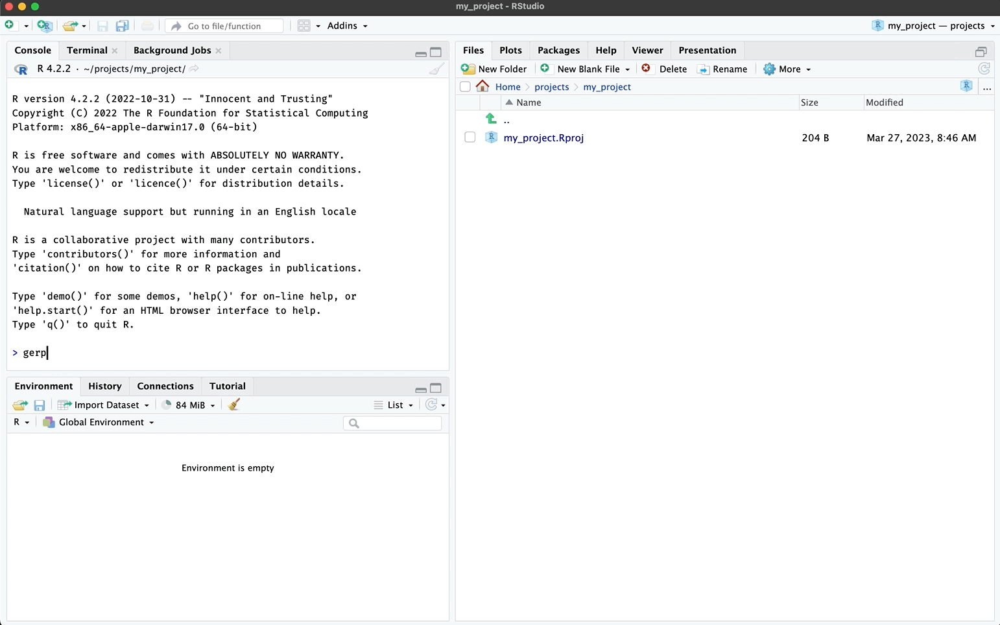

# Good enough data

``` r

library(gerp)
```

## `ger_data()`

Use
[`ger_data()`](https://mjfrigaard.github.io/gerp/reference/ger_data.md)
to create the data folders in your R projects:



  

The
[`ger_data()`](https://mjfrigaard.github.io/gerp/reference/ger_data.md)
creates three folders and a `data.md` file.

``` r
├── data.md
├── data
├── data-raw
└── inst
    └── extdata
```

- `data-raw/`: should contain any code used to import, download and
  include data in your project

- `data/`: should contain processed, intermediate, or otherwise altered
  data in your project

- `inst/exdata/`: should have any external data used for examples or
  testing

- `data.md`: Document your data here and in `code/data.R`

For example, I have stored the `wu_data.csv` data stored in
`inst/exdata/`:

``` r
inst/extdata/
        └── wu_data.csv
```

The code to download `wu_data.csv` from Github in `data-raw/wu_df.R`
(see below)

``` r

## code to prepare `wu_df` dataset goes here
wu_df <- utils::read.csv(
  "https://raw.githubusercontent.com/mjfrigaard/gerp/main/inst/extdata/wu_data.csv")
usethis::use_data(wu_df, overwrite = TRUE)
```

The `usethis::use_data(wu_df, overwrite = TRUE)` command will
automatically save this to the `data/` folder.

``` r
data
  └── wu_df.rda
```

It’s documented in the `code/data.R` example, and I can add more details
in `data.md`.
