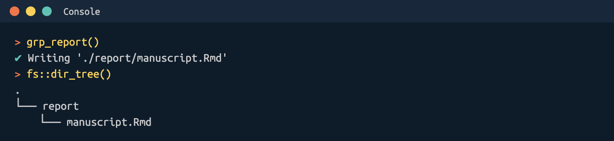

# Good enough documents

``` r

library(gerp)
```

## `grp_dev()`

The
[`grp_dev()`](https://mjfrigaard.github.io/gerp/reference/grp_dev.md)
function creates an R Markdown file for development: `dev/notebook.Rmd`

  


  

``` r
dev/
  └── notebook.Rmd
```

## `grp_report()`

The
[`grp_report()`](https://mjfrigaard.github.io/gerp/reference/grp_report.md)
function creates polished R Markdown file for finalizing a report:
`report/manuscript.Rmd`

  



  

``` r
report/
  └── manuscript.Rmd
```
