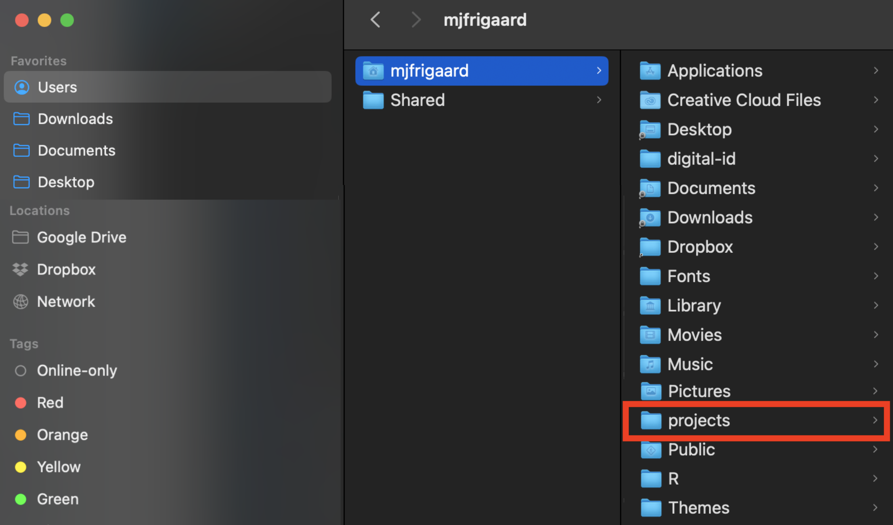
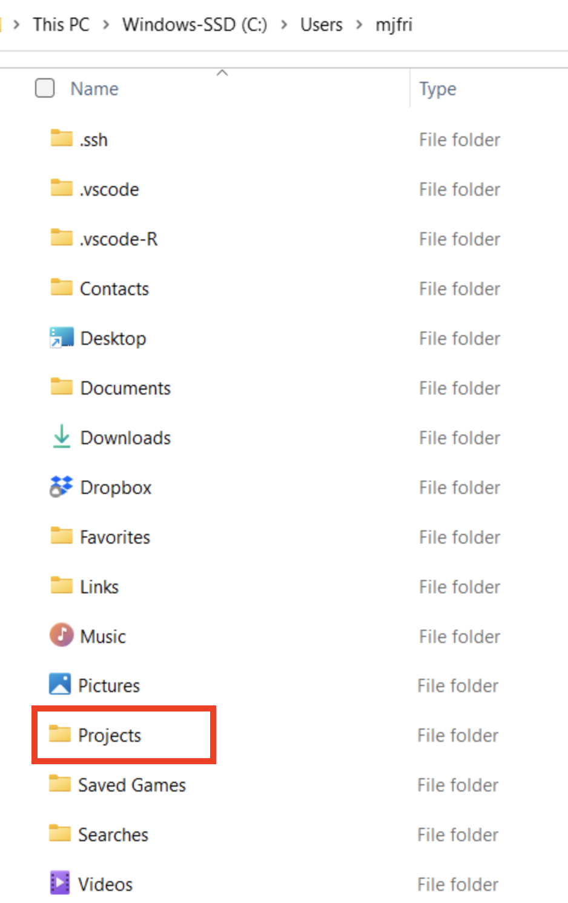
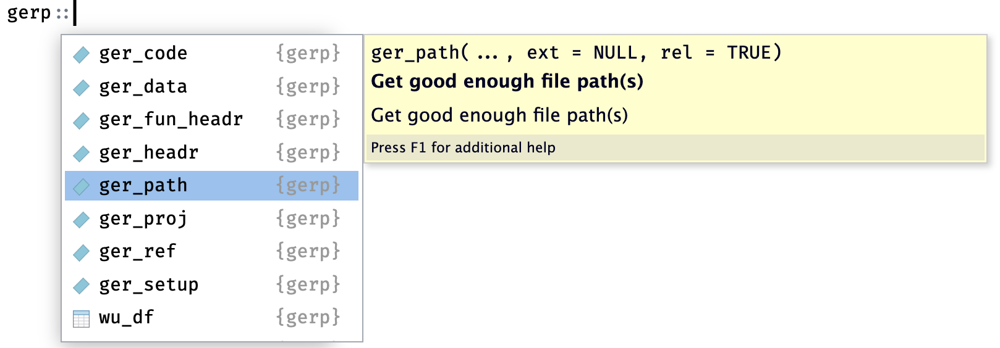
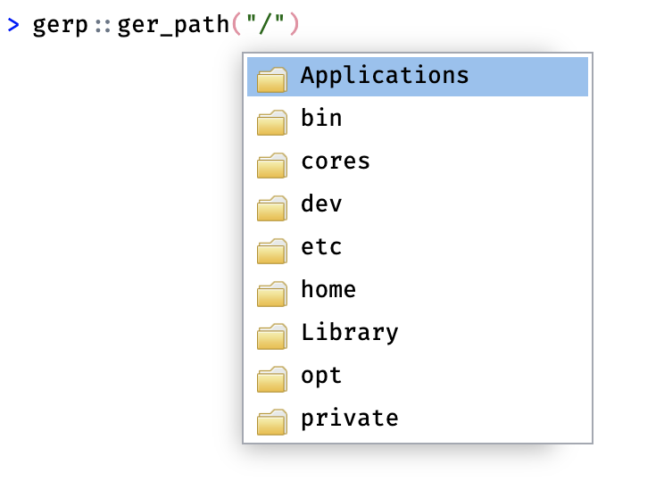
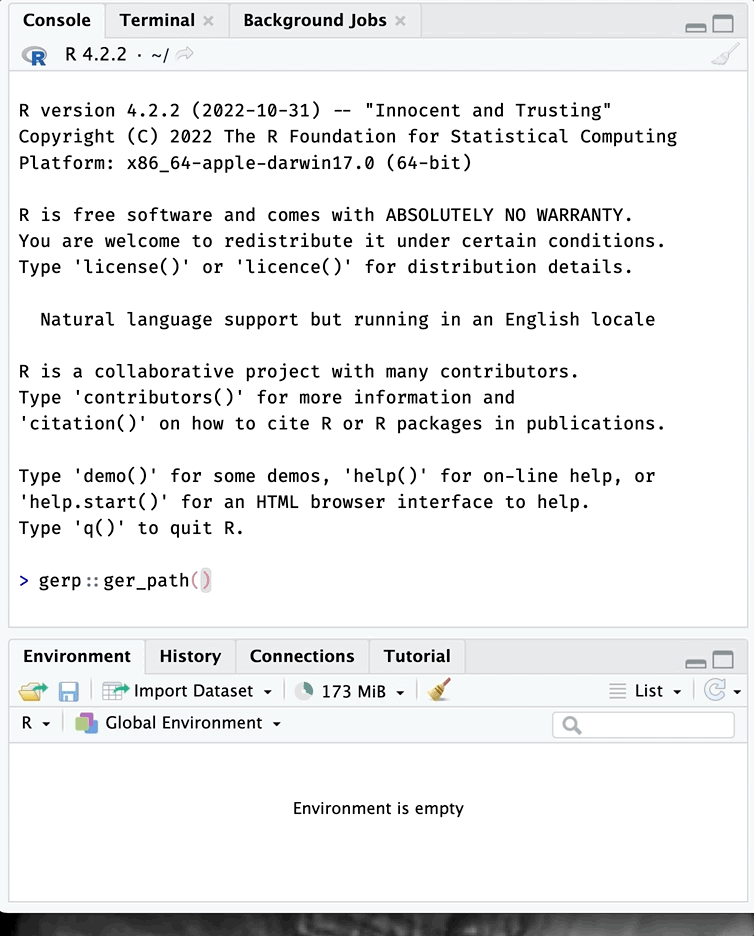
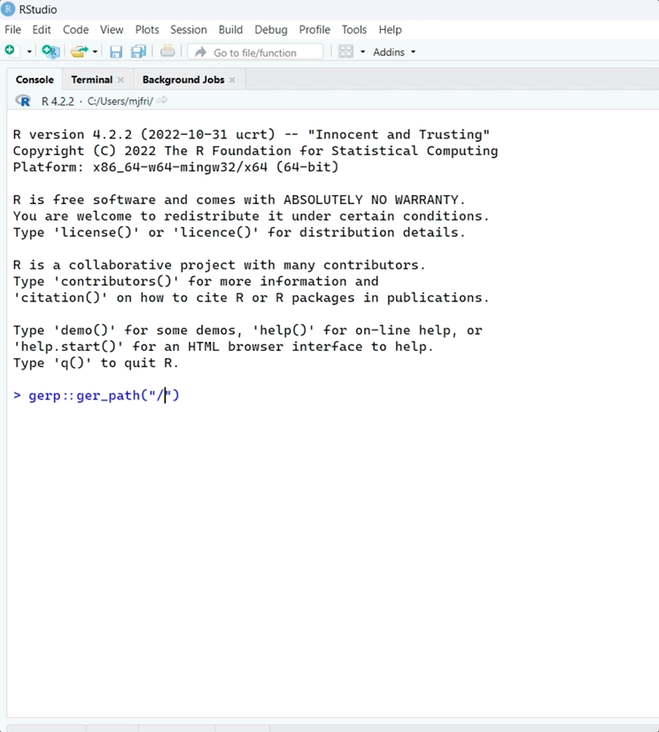

# Folder paths

``` r

library(gerp)
```

> “*If you don’t know where you are going, you’ll end up someplace
> else.*” - [Yogi
> Berra](https://www.goodreads.com/quotes/23616-if-you-don-t-know-where-you-are-going-you-ll-end)

All R projects inevitably involve creating files on your computer, so
it’s important to decide **where your R projects will live.** In this
vignette, we’ll cover some tips and tools for orienting yourself with
your computers’ folder structure.

  

## Folders

An operating system folder structure refers to how files and directories
(i.e. folders) are organized on a computer’s hard drive. Folder
structures can vary depending on the specific operating system being
used. However, most operating systems have the same basic design,
including a hierarchical tree-like arrangement with similar common
folders:

- `Users`/`usr`: user-level programs, utilities, libraries, and
  documentation

- `Library`/`lib`: the shared library files that are used by all
  applications

- `bin`: holds necessary system binary files and programs

- `etc`: contains system configuration files

- `Home`/`home`: user-specific files and directories

Your computer’s operating system folder structure is organized to
provide a logical and predictable way of storing and accessing folders
and files on a computer. Applications like Windows Explorer and Finder
present our computer’s folder and file structure in a display we can
navigate with our mouse and cursor, but behind the scenes they’re
accessing the system paths (or locations).

### Folder paths

Folder paths typically consist of a series of names that indicate the
hierarchical structure of the folder system, separated by a forward
slash (`"/"`) or a backslash (`"\"`) (depending on the operating
system). In Unix-based systems (like macOS or Linux), the topmost (or
*root*) folder is usually represented by a forward slash (`/`). If it’s
a file path, it may also include the file’s extension.

For example, a Linux or macOS file path might look like this:

***`usr/home/docs/file.txt`***

In this system:

- `"usr"` holds user-related programs, utilities, libraries

- `"home"` user-specific files and folders

- `"docs"` is a sub-folder within that user’s home folder, and

- `"file.txt"` is the name and extension of a file

In Windows systems, the root folder is assigned a ‘drive letter’
followed by a backslash (i.e, `C:\`).

An example Windows file path might look like this:

***`C:\Users\Username\Documents\file.txt`***

In this case:

- `"C:"` represents the computer’s hard drive

- `"Users"` is a folder name

- `"Username"` is the user account folder

- `"Documents"` is a sub-folder within that user’s home folder, and

- `"file.txt"` is the name and extension of the file

As you can see from the two examples above, file paths provide the exact
location of a file or folder in the directory structure of a computer’s
file system.

#### An example project folder (macOS)

Let’s assume I’ve created a `projects/` folder for my new R projects.
This new `projects/` folder is a subfolder under my `Users` folder,
which I can locate using using Finder (on macOS):

  



folder structure on macOS

  

The path for this folder would be:

``` bash
/Users/mjfrigaard/projects/
```

  

#### An example project folder (Windows)

If I’m using a Windows system, a similar `Projects/` folder might look
like this in the Windows Explorer:

  



folder structure on Windows

  

The path for this folder would be:

``` bash
C:\Users\mjfri\Projects\
```

  

### RStudio’s default working directory

A new RStudio session opens with the **Files** pane set to my `User`
folder. You might notice the image below is displaying more folders than
Windows Explorer image above:

  


Home folder RStudio (PC)

  

These different displays can be confusing, but it’s only because Windows
Explorer hides some of the System folders you don’t regularly need to
access.

  

Fortunately, RStudio helps me confirm my location by displaying the
folder path in the **Files** pane above the folders:

  


Default working directory (Windows)

  

The folder RStudio initially displays in the **Files** pane is called
the *default working directory*, and it’s configured when you [install
RStudio](https://rstudio-education.github.io/hopr/starting.html). If
you’d like to change it, you can by clicking on **Tools** \> **Global
Options** then **Browse** to the folder you’d like to use:

  


Change default working directory

### Folder navigation in R

R comes with a helpful function for printing our current working
directory (or folder) path:
[`getwd()`](https://rdrr.io/r/base/getwd.html).

On macOS, if I check my working directory, I see it’s my user account
folder:

``` r
getwd()
[1] "/Users/mjfrigaard"
```

The three other functions to help view your computers’ folders and files
are:

1.  [`dir()`](https://rdrr.io/r/base/list.files.html)  
2.  [`list.files()`](https://rdrr.io/r/base/list.files.html)  
3.  [`list.dirs()`](https://rdrr.io/r/base/list.files.html)

I’ll focus on [`dir()`](https://rdrr.io/r/base/list.files.html), but the
other two work in a similar way.

#### Listing folders

Passing [`dir()`](https://rdrr.io/r/base/list.files.html) directly to
the console (with no other arguments) returns the list of folders in the
default working directory:

``` r
dir()
 [1] "Applications"        
 [2] "Creative Cloud Files"
 [3] "Desktop"             
 [4] "Documents"           
 [5] "Downloads"           
 [6] "Dropbox"             
 [7] "Fonts"               
 [8] "Library"             
 [9] "Movies"              
[10] "Music"               
[11] "Pictures"            
[12] "projects"            
[13] "Public"              
[14] "R"                   
[15] "Themes"
```

If we add the `full.names = TRUE` argument, we see the full path to the
folders:

``` r
dir(full.names = TRUE)
 [1] "./Applications"        
 [2] "./Creative Cloud Files"
 [3] "./Desktop"             
 [4] "./Documents"           
 [5] "./Downloads"           
 [6] "./Dropbox"             
 [7] "./Fonts"               
 [8] "./Library"             
 [9] "./Movies"              
[10] "./Music"               
[11] "./Pictures"            
[12] "./projects"            
[13] "./Public"              
[14] "./R"                   
[15] "./Themes"
```

On a PC, `dir(full.names = TRUE)` might look like this:

``` r
 dir(full.names = TRUE)
 [1] "./AppData"                                                             
 [2] "./Application Data"                                                   
 [3] "./Contacts"                                                           
 [4] "./Cookies"                                                             
 [5] "./Desktop"                                                             
 [6] "./Documents"                                                           
 [7] "./Downloads"                                                           
 [8] "./Dropbox"                                                             
 [9] "./Favorites"                                                           
[10] "./IntelGraphicsProfiles"                                               
[11] "./Links"                                                               
[12] "./Local Settings"                                                     
[13] "./Music"                                                               
[14] "./My Documents"                                                       
[15] "./NetHood"                                                             
[16] "./NTUSER.DAT"                                                         
[17] "./OneDrive"                                                           
[18] "./Pictures"                                                           
[19] "./PrintHood"                                                           
[20] "./Projects"                                                           
[21] "./Recent"                                                             
[22] "./Searches"                                                           
[23] "./SendTo"                                                             
[24] "./Start Menu"                                                         
[25] "./Templates"                                                           
[26] "./Videos" 
```

Adding the `full.names` returned the folders in the working directory
and added a `./` prefix. In computer file systems, `"."` and `".."` are
special directories (i.e., folders) that have specific meanings.

- `"."` represents the current folder

- `".."` represents the parent folder in a file path

These directory names are used to specify relative paths to other files
and directories in the file system.

#### Folder trees

[Folder tree’s](https://www.wikiwand.com/en/Directory_structure) are
text displays of a computer’s folder structure. As noted above, all
operating systems organize folders and files in a hierarchical,
tree-like arrangement, with a single root folder (or directory) at the
top, and sub-folders branching off below. Each folder can contain files
and additional subfolders and, in turn, can have more files and
subfolders.

  

``` bash
root/
  └── folder/
        └── subfolder/
```

  

We’ll use folder trees to describe the special directories implied by
`"."` and `".."`:

  

- `"."` represents the current folder the user is currently in. For
  example, if I am in the folder `"/user/jdoe/documents"`, the folder
  tree would look like this:

  ``` bash
  users/
    └── jdoe/
          └── documents/ <- my location
  ```

  - In this case, `"."` refers to same location
    (`"/user/jdoe/documents"`)

  ``` bash
  users/
    └── jdoe/
          └── documents/ -> "." also my location
  ```

- `".."` (dot dot) represents the *parent* folder. `..` is used to refer
  to the folder that *contains* the current folder. For example, if I am
  in the folder `"/user/jdoe/documents"`

  ``` bash
  users/
    └── jdoe/
          └── documents/ <- my location
  ```

  - Then `".."` refers to `"/user/jdoe"`

  ``` bash
  users/
    └── jdoe/ -> ".." parent folder
          └── documents/ 
  ```

### Path functions

`gerp` has three functions designed to help you become familiar with
folder paths:
[`ger_path()`](https://mjfrigaard.github.io/gerp/reference/ger_path.md),
[`ger_root()`](https://mjfrigaard.github.io/gerp/reference/ger_root.md),
and
[`ger_fpath()`](https://mjfrigaard.github.io/gerp/reference/ger_fpath.md)

First we’ll cover
[`ger_path()`](https://mjfrigaard.github.io/gerp/reference/ger_path.md),
because it comes in handy when you’re setting up a new `gerp` project.

#### `ger_path()`

We’ve already installed and loaded the `gerp` package, but sometimes
handy to explicitly tell R which function we intend to use from a
package. We can do this by entering `package::function()`, and you can
see why in the image below:

  


All functions and objects in gerp

  

Using `package::function()` shows us all the functions and objects in a
package. When we select a package item, we can see the documentation in
yellow:

  



help for ger_path()

  

To use
[`ger_path()`](https://mjfrigaard.github.io/gerp/reference/ger_path.md),
start by entering a forward slash enclosed in quotes (`"/"`)

``` r

gerp::ger_path("/")
```

If you hit the **Tab** key, you’ll see the list of folders available
starting at your home directory.

  



Home directory (macOS)

  

You can then continue using your mouse (or the arrow keys) to navigate
to the parent folder you want your R project to live in (in my case,
it’s `/Users/mjfrigaard/projects/`)

  



  

[`ger_path()`](https://mjfrigaard.github.io/gerp/reference/ger_path.md)
works the same way on Windows:

  



  

#### Absolute vs. relative paths

The `type` argument controls whether
[`gerp::ger_path()`](https://mjfrigaard.github.io/gerp/reference/ger_path.md)
returns a relative or absolute folder path. An absolute path returns the
complete and specific location of the folder in the file system,
starting from the root directory.

``` r
gerp::ger_path("/Users/mjfrigaard/projects/", type = "abs")
[1] "/Users/mjfrigaard/projects"
```

A relative path refers to the location of the folder relative to the
current working folder (i.e., the folder where the user is currently
located).

``` r
gerp::ger_path("/Users/mjfrigaard/projects/", type = "rel")
[1] "projects"
```

#### Return a `tree`

If you’d like to see a folder tree for the path in
[`gerp::ger_path()`](https://mjfrigaard.github.io/gerp/reference/ger_path.md),
you can set `tree` to `TRUE`

``` r
gerp::ger_path("/Users/mjfrigaard/projects/", tree = TRUE)
/Users/mjfrigaard/projects
├── apps
├── blogs
├── dev
├── methods
└── pkgs
```

#### `ger_root()`

The
[`ger_root()`](https://mjfrigaard.github.io/gerp/reference/ger_root.md)
function will return the ‘root’ folder path for your project. This comes
in handy if you’re looking for a certain file.

``` r
ger_root()
/Users/mjfrigaard/projects/pkgs/gerp
```

``` r
ger_root(tree = TRUE)
/Users/mjfrigaard/projects/pkgs/gerp
├── DESCRIPTION
├── LICENSE
├── LICENSE.md
├── NAMESPACE
├── NEWS.md
├── R
├── README.Rmd
├── README.md
├── _dev.R
├── _pkgdown.yml
├── data
├── data-raw
├── docs
├── gerp.Rproj
├── inst
├── man
├── ref
└── vignettes
```

#### `ger_fpath()`

[`ger_fpath()`](https://mjfrigaard.github.io/gerp/reference/ger_fpath.md)
will return path to the current file in the **Source** pane.

``` r
ger_fpath()
/Users/mjfrigaard/projects/pkgs/gerp/vignettes/paths.Rmd
```

If `tree` is set to `TRUE`, a folder tree is returned:

``` r
ger_fpath(tree = TRUE)
/Users/mjfrigaard/projects/pkgs/gerp/vignettes
└── paths.Rmd
```

#### `ger_lkp_path()`

[`ger_lkp_path()`](https://mjfrigaard.github.io/gerp/reference/ger_lkp_path.md)
will return the folder tree (or trees) of the provided file or folder to
`x`:

``` r
# check for inst/ folder
gerp::ger_lkp_path("inst")
/Users/mjfrigaard/projects/pkgs/gerp
└── inst
```

``` r
# check for README.Rmd files
gerp::ger_lkp_path(x = "README.Rmd")
/Users/mjfrigaard/projects/pkgs/gerp
└── README.Rmd
/Users/mjfrigaard/projects/pkgs/gerp/inst/rmarkdown/templates/gerp-README
└── README.Rmd
```

------------------------------------------------------------------------

1.  The name for this package comes from the excellent article, ‘[Good
    enough practices in scientific
    computing](https://journals.plos.org/ploscompbiol/article?id=10.1371/journal.pcbi.1005510)’
    by Greg Wilson, Jennifer Bryan, Karen Cranston, Justin Kitzes, Lex
    Nederbragt and Tracy K. Teal

2.  Jenny Bryan and Jim Hester address many of these topics in ‘[What
    they forgot to teach you about R](https://rstats.wtf/)’, and I’ve
    codified them into this package wherever I could.
