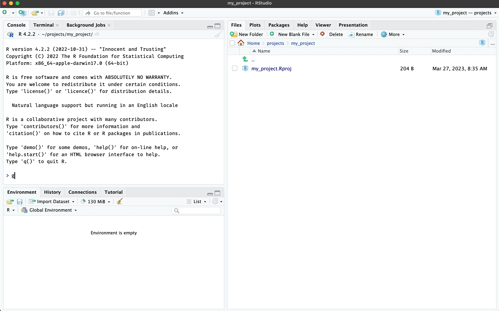

# Good enough setup

``` r

library(gerp)
```

## `ger_setup()`

For quick setup, run the
[`ger_setup()`](https://mjfrigaard.github.io/gerp/reference/ger_setup.md)
function to create `changelog.md`, `LICENSE`, `CITATION` and
`requirements.md` files.


