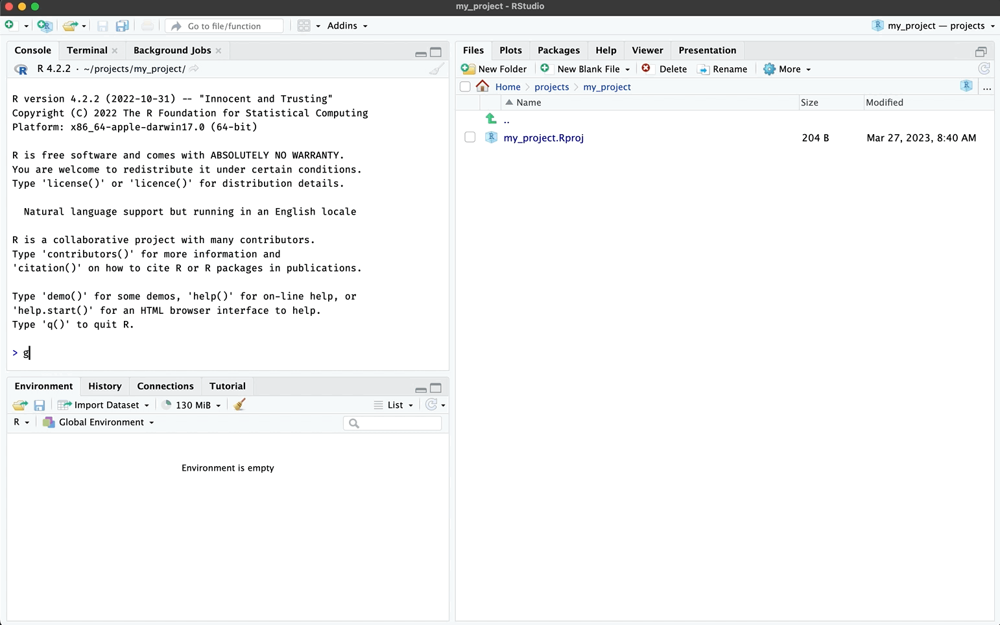
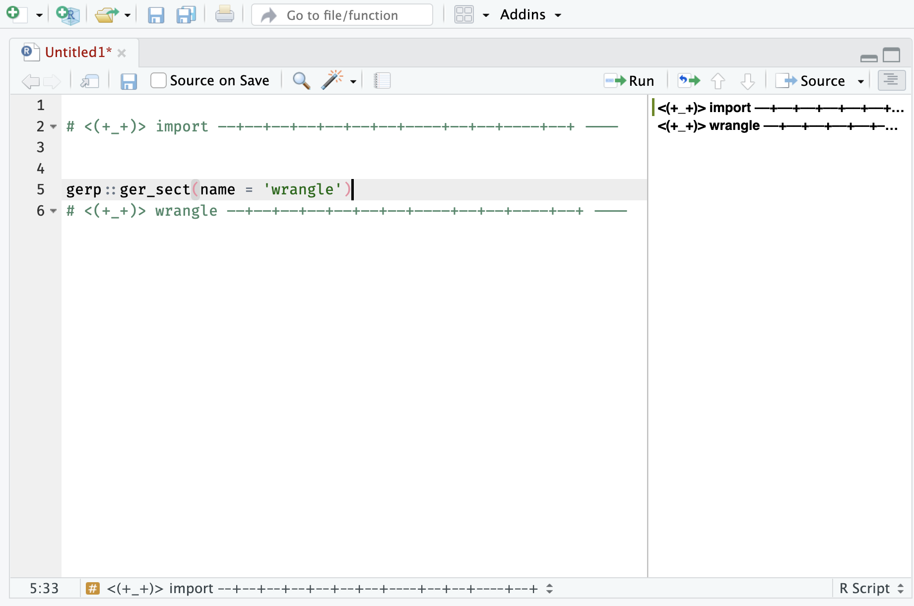

```{r, include = FALSE}
knitr::opts_chunk$set(
  collapse = TRUE,
  comment = "#>"
)
```

```{r setup}
library(gerp)
```

# `ger_code()`

Use `ger_code()` to create the `R/` code folder in your projects: 

```{r ger_code, echo=FALSE, out.width='100%', eval=TRUE, fig.align='center'}

```

The `ger_code()` creates the following files:

```{r code, eval=FALSE}
R/
  ├── data.R
  ├── import.R
  ├── model.R
  ├── tidy.R
  ├── visualize.R
  └── wrangle.R
```

You can choose to have regular R script headers or `roxygen2` headers:

#### `header = TRUE` (default)

```{r , eval=FALSE}
#' @title 
#' 
#' 
#' @description
#' 
#' @details
#' 
#' @importFrom
#' 
#' @examples 
#' 
#'
```

#### `header = FALSE`

```{r , eval=FALSE}
#=====================================================================#
# This is code to create:
# Authored by and feedback to:
# MIT License
# Version:
#=====================================================================#
```

### `R/data.R`

The `R/data.R` file should be used for documenting datasets in your project. See example below:

```{r , eval=FALSE}
#' Title (dataset description)
#'
#' @format A dataset with variables:
#' \describe{
#'   \item{member}{Wu-Tang Clan Member Name}
#'   \item{name}{Wu-Tang Clan Given Name}
#'   \item{born}{Birth Year}
#'   \item{city}{Birth City}
#'   \item{alive}{Stil Alive?}
#' }
#' @source Link to data: https://en.wikipedia.org/wiki/Wu-Tang_Clan
#' (downloaded YYYY-MM-DD)
'wu_df'
```

This will create the `.Rd` document so your dataset is accessible in the **Help** pane.

<br>

```{r data-rd, echo=FALSE, out.width='70%', eval=TRUE, fig.align='center'}
knitr::include_graphics("../man/figures/data-rd.png")
```

# Headers 

Even if you're not using [`roxygen2` tags](https://roxygen2.r-lib.org/articles/rd.html), it's a good idea to put a header on your code files. This helps collaborators (and you!) track what the script does.

```{r eval=FALSE}
gerp::ger_headr()
#~~~~~~~~~~~~~~~~~~~~~~~~~~~~~~~~~~~~~~~~~~~~~~~~~~~~~~~~~~~~~~~~~~~~~#
# This is code to create:
# Authored by and feedback to:
# MIT License
# Version:
#~~~~~~~~~~~~~~~~~~~~~~~~~~~~~~~~~~~~~~~~~~~~~~~~~~~~~~~~~~~~~~~~~~~~~#
```

## Sections 

`gerp::ger_sect()` will create a code section based on a `name` input:

```{r eval=FALSE}
gerp::ger_sect(name = 'import')
# <(+_+)> import ––+––+––+––+––+––+––+––––+––+––+––––+––+ ----
```

These are handy if you use RStudio's outline feature: 

<br>

```{r ger_sect, echo=FALSE, out.width='100%', eval=TRUE, fig.align='center'}

```

