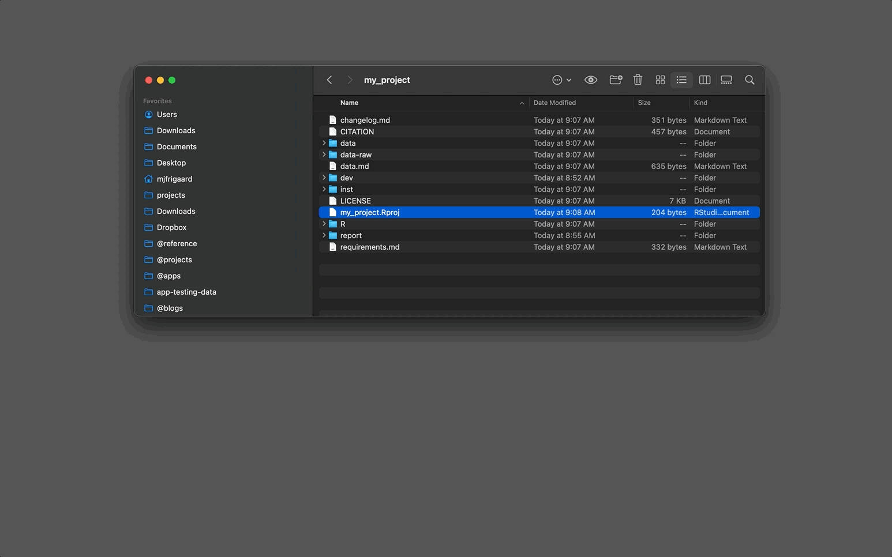

```{r, include = FALSE}
knitr::opts_chunk$set(
  collapse = TRUE,
  comment = "#>"
)
```

```{r setup}
library(gerp)
```


# Creating a `gerp` projects

There are two functions for creating a new `gerp` project: `ger_proj()` and `ger_create()`.

## `ger_proj()`

The quickest way to create a new `gerp` project is with `gerp::ger_proj()`. 

1. First you need to install the package from GitHub. 

```{r instal-remotes, eval=FALSE}
install.packages("remotes")
remotes::install_github("mjfrigaard/gerp")
```

2. Then enter the following in your R **Console** pane:

```{r example, eval=FALSE}
gerp::ger_proj()
```

You'll see the following: 

<br>

```{r new_ger_proj-gif, echo=FALSE, eval=TRUE, out.width='100%', fig.align='center', fig.cap='New gerp project with gerp::ger_proj()'}
knitr::include_graphics("../man/figures/new_ger_proj.gif")
```

<br>

New `gerp` projects created with `gerp::ger_proj()` will automatically place the new project on your Desktop or some other conspicuous location. ([1](https://usethis.r-lib.org/reference/zip-utils.html#arguments))

## `ger_create()`

The `ger_create()` function assumes you've navigated to your project folder and have the path in a quoted text string (i.e, `"/Users/mjfrigaard/projects/"`). If you need help locating a home for your R projects, check out the [Folder paths vignette](https://mjfrigaard.github.io/gerp/articles/paths.html). 

1. Locate or create your R projects folder. You can store the output in a variable (`pth`) and pass it to the `folder` argument in `gerp::ger_create()` (or pass the full path in quotes).

<br>

```{r ger_create, eval=FALSE}
pth <- gerp::ger_path("/Users/mjfrigaard/projects/")
gerp::ger_create(
  folder = pth, 
  name = "my project")
```

<br>

2. After running `gerp::ger_create()`, a new 'good enough' R project will open in a new session:

<br>

```{r my_project.gif, echo=FALSE, eval=TRUE, out.width='100%', fig.align='center', fig.cap='New gerp project!'}
knitr::include_graphics("../man/figures/my_project.gif")
```

## `.Rproj` files

`gerp` projects use RStudio's project files (with extension `.Rproj`). `.Rproj` files ["contain project options and can also be used as a shortcut for opening the project directly from the filesystem."](https://support.posit.co/hc/en-us/articles/200526207-Using-RStudio-Projects).([2](https://support.posit.co/hc/en-us/articles/200534477))

<br>

When I want to re-open my RStudio project, I navigate to the `.Rproj` file and double-click on it to open RStudio: 

<br>

```{r open_rproj-gif, echo=FALSE, eval=TRUE, out.width='100%', fig.align='center', fig.cap='Opening an RStudio project'}

```

***

1. `gerp::ger_proj()` use the [`usethis::use_course()` function](https://usethis.r-lib.org/reference/zip-utils.html) to download the zip file. 

2. If you're already using a cloud platform like [Dropbox](https://www.dropbox.com/) or [Google Drive](https://www.google.com/drive/) to keep track of your files, choose a different location for your R project folders. Cloud storage services are great, but they've been known to [cause issues](https://support.posit.co/hc/en-us/articles/200534477) when working with R and RStudio. 
