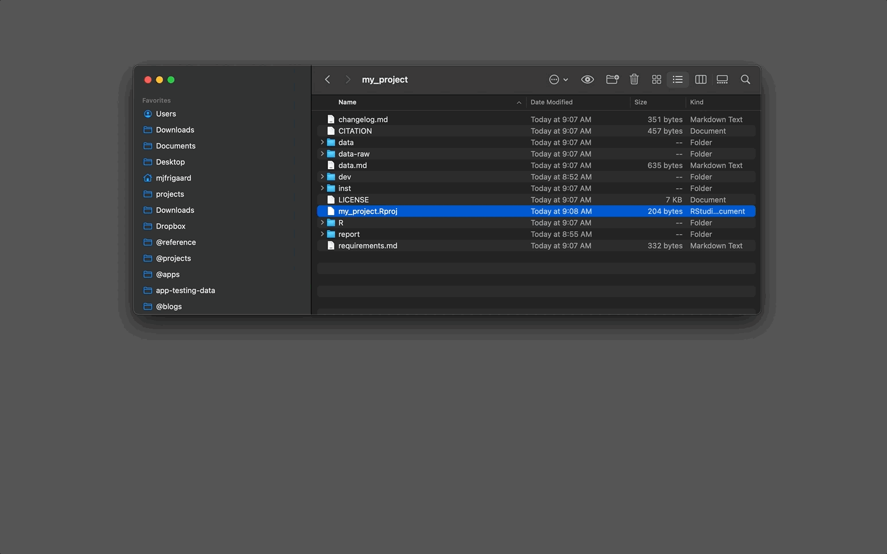

```{r, include = FALSE}
knitr::opts_chunk$set(
  collapse = TRUE,
  comment = "#>"
)
```

```{r setup}
library(gerp)
```


# Creating a `gerp` projects

Use `ger_create()` to create a new `gerp` project.

1. First you need to install the package from GitHub.

```{r instal-pak, eval=FALSE}
install.packages("pak")
pak::pak("mjfrigaard/gerp")
```

2. Pass the path to your new project folder to `ger_create()`. The folder must not exist yet. If you need help locating a home for your R projects, check out the [Folder paths vignette](https://mjfrigaard.github.io/gerp/articles/paths.html).

<br>

```{r ger_create, eval=FALSE}
gerp::ger_create("~/projects/my-project")
```

<br>

3. After running `gerp::ger_create()`, the new 'good enough' R project will open in a new RStudio or Positron session (set `open = FALSE` to stay in your current session):

<br>

```{r my_project.gif, echo=FALSE, eval=TRUE, out.width='100%', fig.align='center', fig.cap='New gerp project!'}
knitr::include_graphics("../man/figures/my_project.gif")
```

## `.Rproj` files

`gerp` projects use RStudio's project files (with extension `.Rproj`). `.Rproj` files ["contain project options and can also be used as a shortcut for opening the project directly from the filesystem."](https://support.posit.co/hc/en-us/articles/200526207-Using-RStudio-Projects).([2](https://support.posit.co/hc/en-us/articles/200534477))

<br>

In Positron, use **File > Open Folder** to re-open a project. When I want to re-open my RStudio project, I navigate to the `.Rproj` file and double-click on it to open RStudio: 

<br>

```{r open_rproj-gif, echo=FALSE, eval=TRUE, out.width='100%', fig.align='center', fig.cap='Opening an RStudio project'}

```

***

1. Positron doesn't need the `.Rproj` file (open the project folder instead), but it's harmless to keep it.

2. If you're already using a cloud platform like [Dropbox](https://www.dropbox.com/) or [Google Drive](https://www.google.com/drive/) to keep track of your files, choose a different location for your R project folders. Cloud storage services are great, but they've been known to [cause issues](https://support.posit.co/hc/en-us/articles/200534477) when working with R and RStudio. 
