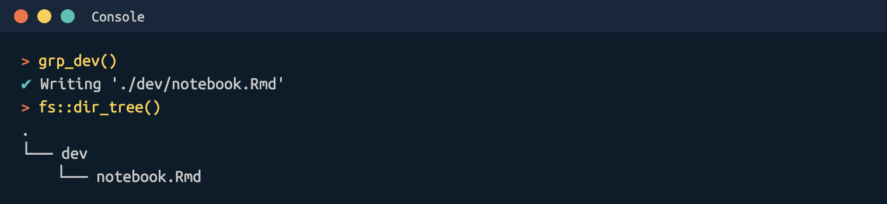

```{r, include = FALSE}
knitr::opts_chunk$set(
  collapse = TRUE,
  comment = "#>"
)
```

```{r setup}
library(gerp)
```

# `grp_dev()`

The `grp_dev()` function creates an R Markdown file for development: `dev/notebook.Rmd`

<br>

```{r grp_dev-gif, echo=FALSE, out.width='100%', eval=TRUE, fig.align='center'}

```

<br>

```{r dev, eval=FALSE}
dev/
  └── notebook.Rmd
```


# `grp_report()`

The `grp_report()` function creates polished R Markdown file for finalizing a report: `report/manuscript.Rmd`

<br>

```{r grp_report-gif, echo=FALSE, out.width='100%', eval=TRUE, fig.align='center'}
knitr::include_graphics("../man/figures/grp_report.png")
```

<br>

```{r report, eval=FALSE}
report/
  └── manuscript.Rmd
```
