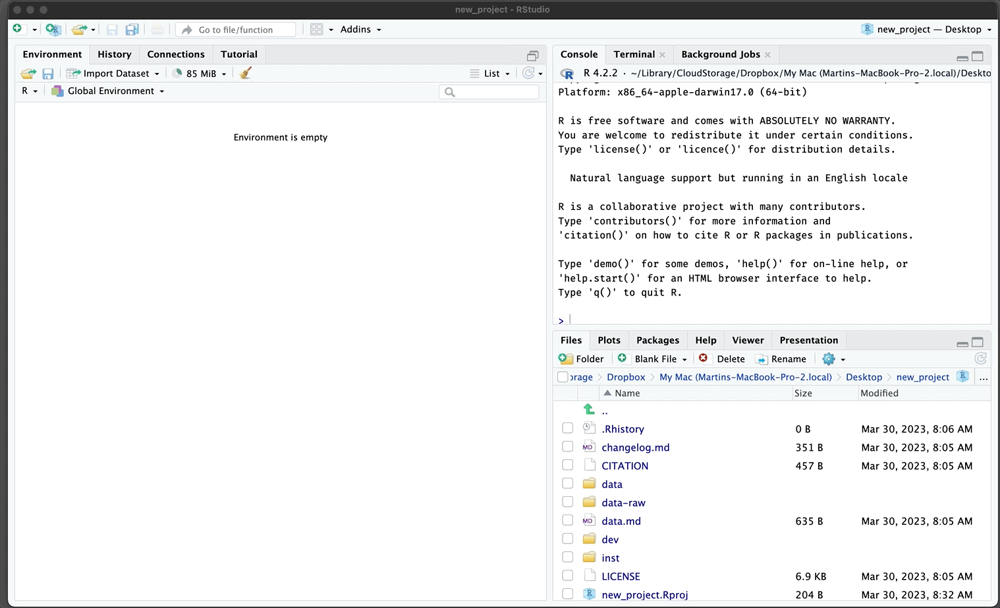
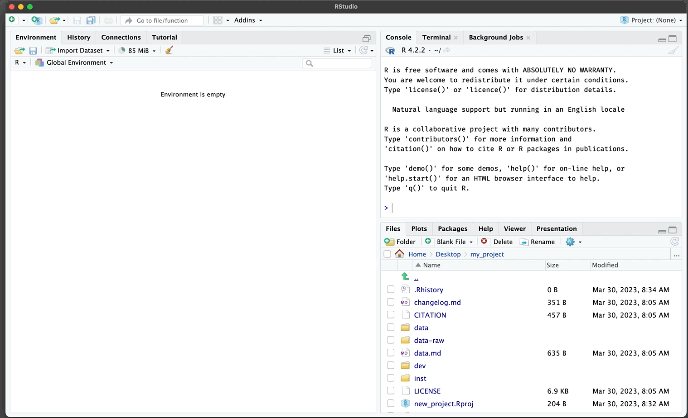
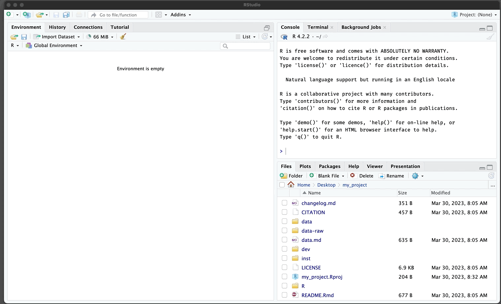

```{r setup, include = FALSE}
knitr::opts_chunk$set(
  collapse = TRUE,
  comment = "#>", 
  eval = FALSE
)
```


A [Google search](https://bfy.tw/Tx85) for the question above will return a deluge of websites, tutorials, YouTube videos and blog posts. The results probably aren't incorrect, but they're not likely to contain any practices or habits new R users should adopt when beginning their R journey. `gerp` was written to help guide new users towards a set of ‘good enough’ practices that have been shown to help "[*you get more done in less time and with less pain.*](https://journals.plos.org/ploscompbiol/article?id=10.1371/journal.pcbi.1005510#sec028)*"*[1] New R users often struggle to find these habits because they aren’t typically covered in textbooks or online documentation (with some great exceptions[2]), but adopting at least a few of these practices will increase your productivity when you’re using R (and your computer in general!).


This vignette will go over how to install and load the `gerp` package, navigating your computers folders and files, and how to get started with a new `gerp` R project.

> ***Practice (prăk′tĭs)***
> 
> *To do or perform habitually or customarily; make a habit of*

One of the first practices we're going to cover is installing and loading packages. R packages are a collection of functions, data, and documentation bundled in a standardized format. R packages are a vital part of the R ecosystem and provide users with a wide range of data analysis, visualization, and modeling tools. Understanding where and how to access them is essential to your early success.

## Install a package

R is an open-source programming language, so anyone can create an R package. These packages are typically shared with other R users through online repositories like the [Comprehensive R Archive Network (CRAN)](https://cran.r-project.org/web/packages/available_packages_by_name.html) or [GitHub](https://github.com/).

Enter the code below in your R console to download the most recent version of `gerp` from GitHub:

```{r eval=FALSE}
install.packages("remotes")
remotes::install_github("mjfrigaard/gerp")
```

## Load a package

After `gerp` is installed, load the package using the `library()` function

```{r eval=FALSE}
library(gerp)
```

# Quick start

If you'd like to get up and running with a new `gerp` project quickly, you can enter the following code in your RStudio **Console** pane (in a fresh RStudio session)

```{r ger_proj, eval=FALSE}
gerp::ger_proj()
```

You'll see the following:

<br>

```{r new_ger_proj-gif, echo=FALSE, eval=TRUE, out.width='90%', fig.align='center', fig.cap='new gerp project on Windows'}
knitr::include_graphics("../man/figures/new_ger_proj.gif")
```

<br>

`gerp::ger_proj()` will default to the your Desktop folder  (or some other conspicuous place). It's unlikely you'll want your project named, '`new_project`'. I'll demonstrate how to change the name of a new `gerp` project on macOS below:

<br>

Close the RStudio project:

<br>

```{r close_new_proj-gif-gif, echo=FALSE, eval=TRUE, out.width='90%', fig.align='center', fig.cap='Close gerp project'}

```

<br>

Navigate the the `new_project` folder (it should be in your **Desktop** folder) and give it a new name: 

<br>

```{r rename_new_proj_folder-gif, echo=FALSE, eval=TRUE, out.width='90%', fig.align='center', fig.cap='Rename gerp project folder'}
knitr::include_graphics("../man/figures/rename_new_proj_folder.gif")
```

<br>

You'll also need to rename the `.Rproj` file (inside your project folder)

<br>

```{r rename_new_proj_file-gif, echo=FALSE, eval=TRUE, out.width='90%', fig.align='center', fig.cap='Rename gerp project file'}

```

<br>

To re-open my project, I navigate to the `.Rproj` file and double-click on it to open RStudio.

<br>

```{r open_new_proj-gif, echo=FALSE, eval=TRUE, out.width='90%', fig.align='center', fig.cap='Rename gerp project file'}

```
