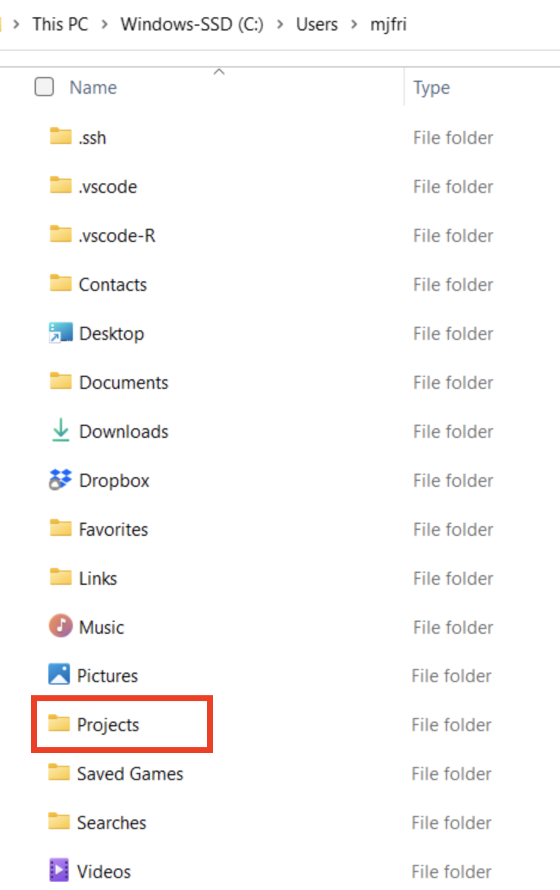
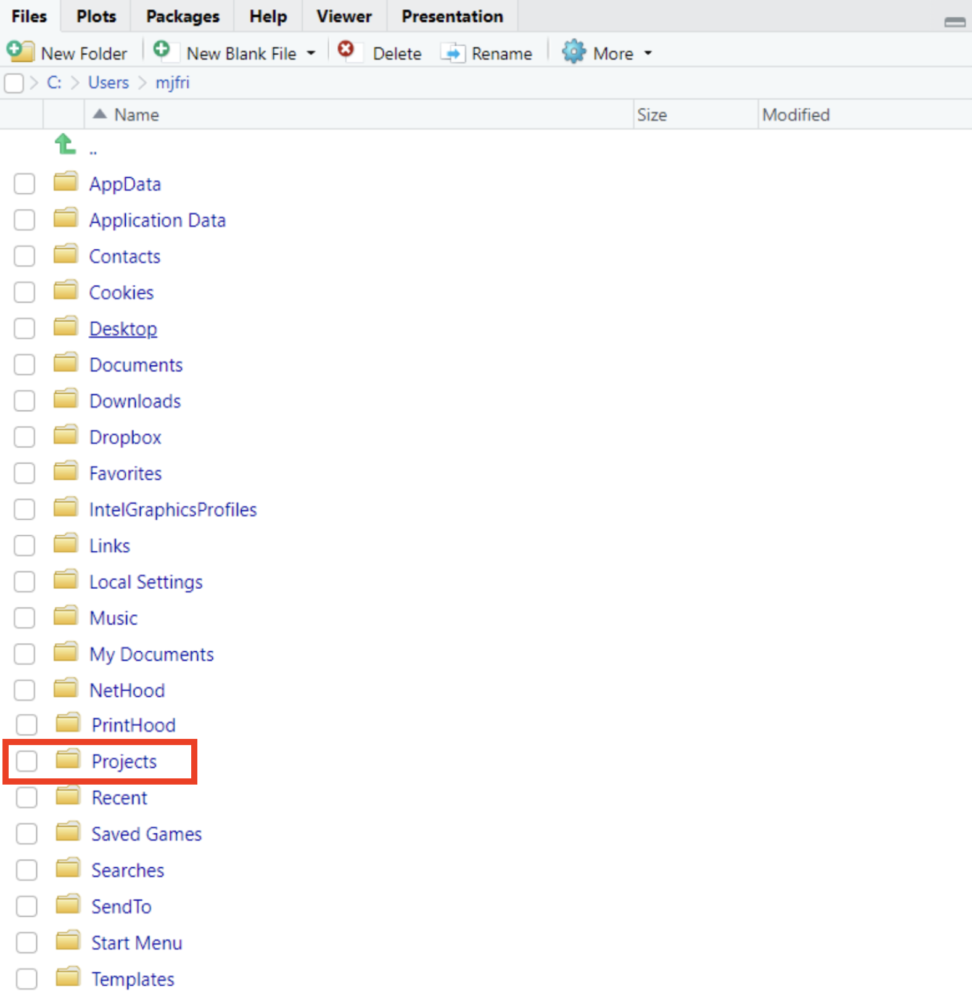
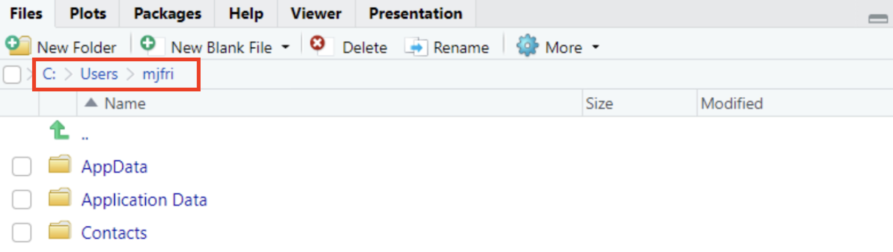
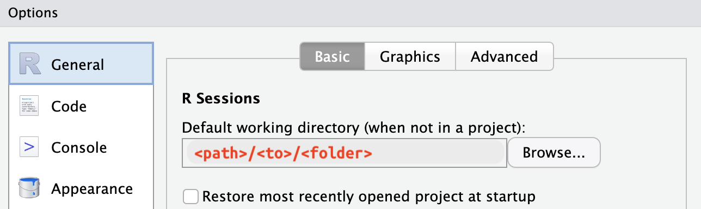
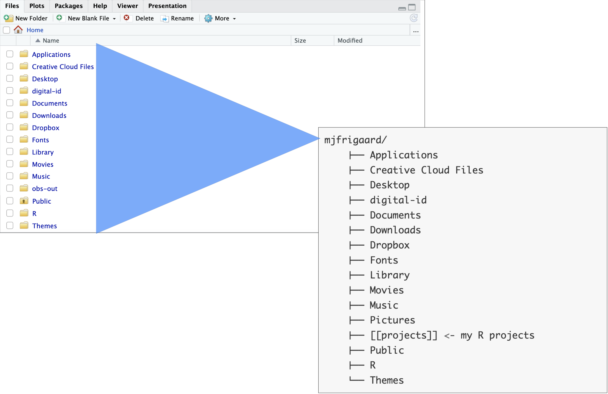
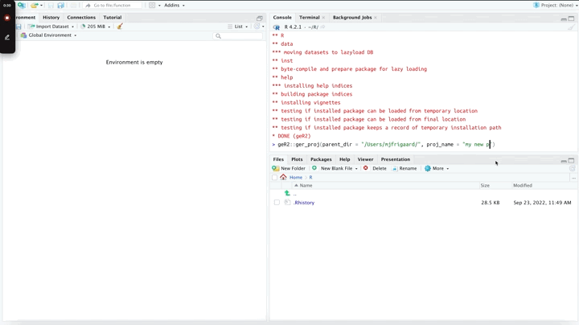
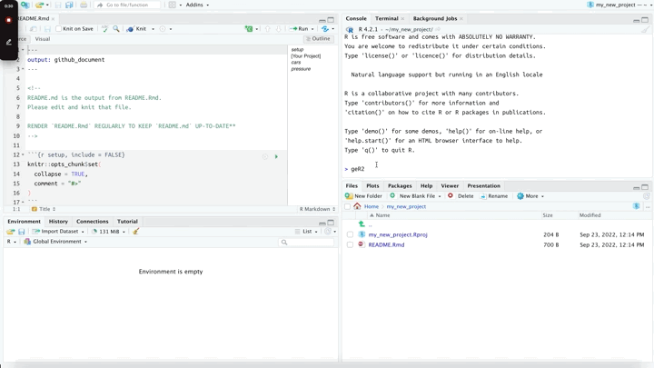

```{r setup, include = FALSE}
knitr::opts_chunk$set(
  collapse = TRUE,
  comment = "#>", 
  eval = FALSE
)
```


<!--
[ChatGPT](https://www.wikiwand.com/en/ChatGPT): 'how to I start learning R?'

> *Great question! R is a popular programming language that is widely used for data analysis and statistical computing. Here are some steps to get started learning R:*
>
> -   ***Install R:** The first step is to download and install R on your computer. You can download R for free from the Comprehensive R Archive Network (CRAN) website.*
>
>
> -   ***Install RStudio**: RStudio is a popular integrated development environment (IDE) for R. It provides a user-friendly interface and makes it easy to write and run R code. You can download RStudio for free from their website.*
>
> -   ***Learn the basics**: Once you have installed R and RStudio, it's time to start learning the basics of R. You can start by learning about data types, variables, functions, and basic programming concepts like loops and conditionals.*
>
> -   ***Practice coding**: The best way to learn R is by practicing coding. Try to write small programs to solve simple problems. You can find practice problems and coding challenges online or in books.*
>
> -   ***Learn data analysis**: R is widely used for data analysis, so it's important to learn how to use R for data manipulation, cleaning, and visualization. There are many online resources and courses that can help you learn these skills.*
>
> -   ***Join the R community**: There is a large community of R users and developers online. You can join forums, attend meetups, and follow blogs and social media accounts to learn from other R users and get help with your coding questions.*
>
> *Remember, learning R takes time and practice, so don't get discouraged if you don't understand everything at once. Just keep practicing and you'll get better over time!*

-->

A [Google search](https://bfy.tw/Tx85) for the question above will return a deluge of websites, tutorials, YouTube videos and blog posts. The results probably aren't incorrect, but they're not likely to contain any practices or habits new R users should adopt when beginning their R journey. `gerp` was written to help guide new users towards a set of ‘good enough’ practices that have been shown to help "[*you get more done in less time and with less pain.*](https://journals.plos.org/ploscompbiol/article?id=10.1371/journal.pcbi.1005510#sec028)*"*[^1] New R users often struggle to find these habits because they aren’t typically covered in textbooks or online documentation (with some great exceptions[^2]), but adopting at least a few of these practices will increase your productivity when you’re using R (and your computer in general!).

[^1]: The name for this package comes from the excellent article, '[Good enough practices in scientific computing](https://journals.plos.org/ploscompbiol/article?id=10.1371/journal.pcbi.1005510)' by Greg Wilson, Jennifer Bryan, Karen Cranston, Justin Kitzes, Lex Nederbragt and Tracy K. Teal

[^2]: Jenny Bryan and Jim Hester address many of these topics in '[What they forgot to teach you about R](https://rstats.wtf/)', and I've codified them into this package wherever I could.


This vignette will go over how to install and load the `gerp` package, navigating your computers folders and files, and how to get started with a new R project.


## **practice (prăk′tĭs)**

> *To do or perform habitually or customarily; make a habit of*

One of the first practices we're going to cover is installing and loading packages. R packages are a collection of functions, data, and documentation bundled in a standardized format. R packages are a vital part of the R ecosystem and provide users with a wide range of data analysis, visualization, and modeling tools. Understanding where and how to access them is essential to your early success.

## Install a package

R is an open-source programming language, so anyone can create an R package. These packages are typically shared with other R users through online repositories like the [Comprehensive R Archive Network (CRAN)](https://cran.r-project.org/web/packages/available_packages_by_name.html) or [GitHub](https://github.com/).

Enter the code below in your R console to download the most recent version of `gerp` from GitHub:

```{r eval=FALSE}
install.packages("remotes")
remotes::install_github("mjfrigaard/gerp")
```

## Load a package

After `gerp` is installed, load the package using the `library()` function

```{r eval=FALSE}
library(gerp)
```

## Folder structure orientation 

> “*If you don't know where you are going, you'll end up someplace else.*” - [Yogi Berra](https://www.goodreads.com/quotes/23616-if-you-don-t-know-where-you-are-going-you-ll-end)

An operating system folder structure refers to how files and directories are organized on a computer's hard drive. Folder structures can vary depending on the specific operating system being used. However, most operating systems have the same basic design, including a hierarchical tree-like arrangement of the following directories (or folders).

-   `Users`/`usr`: user-level programs, utilities, libraries, and documentation

-   `Library`/`lib`: the shared library files that are used by all applications

-   `bin`: holds necessary system binary files and programs 

-   `etc`: contains system configuration files

-   `Home`/`home`: user-specific files and directories

Your computer's operating system folder structure is organized to provide a logical and predictable way of storing and accessing folders and files on a computer. Applications like Windows Explorer and Finder present our computer's folder and file structure in a display we can navigate with our mouse and cursor, but behind the scenes they're accessing the system paths (or locations).

A system folder or file path is a unique address or location on a computer operating system. Paths provide the exact location of a file or folder in the directory structure of the computer's file system. Folder paths typically consist of a series of names that indicate the hierarchical structure of the folder system, separated by a forward slash (`/`) or a backslash (`\`) (depending on the operating system). If it's a file path, it may also include the file's extension.

For example, a Windows file path might look like this:

***`C:\Users\Username\Documents\file.txt`***

In this case: 

*   `"C:"` represents the computer's hard drive  

*   `"Users"` is a folder name  

*   `"Username"` is the user account folder 

*   `"Documents"` is a sub-folder within that user's home folder, and 

*   `"file.txt"` is the name and extension of the file

### Paths in RStudio

R projects inevitably involve creating some kind of file (and usually more than one!), so the first thing to I need to decide is **where my projects will live.** To keep things simple, I've chosen to place my R projects in a `projects/` folder. 

I've created the `projects/` folder in my `Users` folder, which I can locate using using Finder (on macOS):

<br>

```{r my-projects, echo=FALSE, eval=TRUE, out.width='80%', fig.align='center', fig.cap='folder structure on macOS'}
knitr::include_graphics("../man/figures/my-projects.png")
```

<br>

If I'm using a PC, a similar `Projects/` folder might look like this in the Windows Explorer:

<br>

```{r my-folders-win, echo=FALSE, eval=TRUE, out.width='55%', fig.align='center', fig.cap='folder structure on Windows'}

```

## RStudio's default working directory

When I open RStudio (on a PC), the **Files** pane is set to my `User` folder (image below), but it's displaying more folders than Windows Explorer (image above):

<br>

```{r home-win, echo=FALSE, eval=TRUE, out.width='80%', fig.align='center', fig.cap='Home folder RStudio (macOS)'}

```

<br>

These different displays can be confusing, which is it's better to think of file and folder paths as a location on map--one digit off and you'll end up in wrong place. However, I can confirm my location by checking the directory path in the **Files** pane above the folders: 

<br>

```{r rstudio-files-path-win, echo=FALSE, eval=TRUE, out.width='90%', fig.align='center', fig.cap='Directory path (Windows)'}

```

<br>

The folder RStudio opens with is called the *Default working directory*, and it's configured when you [install RStudio](https://rstudio-education.github.io/hopr/starting.html). If you'd like to change it, you can by clicking on **Tools** > **Global Options** then **Browse** to the folder you'd like to use: 

<br>

```{r new-default-wd.png, echo=FALSE, eval=TRUE, out.width='90%', fig.align='center', fig.cap='Change default working directory'}

```


### Locating folder paths in R

R comes with a helpful function for printing our current working directory folder path: `getwd()`.

```{r getwd, eval=FALSE}
getwd()
[1] "/Users/mjfrigaard"
```

Three other helpful functions for view our computers folders and files are: `dir()`, `list.files()`, and `list.dirs()`

We're going to focus on `dir()`, but the other two function in a similar way. Passing `dir()` to the console returns the list of folders in the default working directory:

```{r dir, eval=FALSE}
dir()
 [1] "Applications"         "Creative Cloud Files" "Desktop"             
 [4] "digital-id"           "Documents"            "Downloads"           
 [7] "Dropbox"              "Fonts"                "Library"             
[10] "Movies"               "Music"                "obs-out"             
[13] "Pictures"             "projects"             "Public"
[16] "R"                    "Themes"
```


### Folder trees

A handy tool for navigating your computer's folder structure is the folder tree. As noted above, computers organize folders and files in a hierarchical tree-like arrangement. 

In both cases, the *Home* folder in RStudio's **Files** pane is identical to the `Users/mjfrigaard` folder above:

<br>

If I was to view the Finder display as a hierarchical folder tree, it would have the following structure: 

<br>

```bash
mjfrigaard/
    ├── Applications
    ├── Creative Cloud Files
    ├── Desktop 
    ├── digital-id
    ├── Documents 
    ├── Downloads 
    ├── Dropbox 
    ├── Fonts
    ├── Library
    ├── Movies
    ├── Music
    ├── Pictures
    ├── [[projects]] <- my R projects
    ├── Public
    ├── R
    └── Themes 
```

<br>

```{r home-user-root, echo=FALSE, eval=TRUE, out.width='100%', fig.align='center'}

```


## Creating a `gerp` project


```{r example, eval=FALSE}
gerp::ger_proj(parent_dir = "/Users/<username>/<folder?", proj_name = "my new project")
```

```{r gerp-new-proj, echo=FALSE, eval=TRUE, out.width='100%'}

```

**Note**: If you're already using a cloud platform like [Dropbox](https://www.dropbox.com/) or [Google Drive](https://www.google.com/drive/) to keep track of your files, choose a different location for your R project folders. Cloud storage services are great, but they've been known to [cause issues](https://support.posit.co/hc/en-us/articles/200534477) when working with R and RStudio. 

# `ger_setup()`

The first 

For quick setup, run the `ger_setup()` function to create `code/`, `data/`, and `ref/` folders.

```{r gerp-setup, echo=FALSE, eval=TRUE, out.width='100%'}

```

