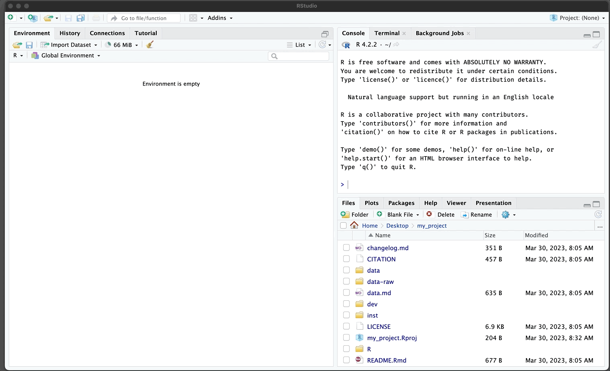

```{r setup, include = FALSE}
knitr::opts_chunk$set(
  collapse = TRUE,
  comment = "#>", 
  eval = FALSE
)
```

A [Google search](https://bfy.tw/Tx85) for the question "*where should I start learning R?*" will return a deluge of websites, tutorials, YouTube videos and blog posts. These results probably aren't incorrect, but they're not likely to list any of the important practices and habits new R users should adopt when beginning their R journey. 


`gerp` was written to help guide new users towards a set of 'good enough' practices that have been shown to help "*you get more done in less time and with less pain.*"([1](https://swcarpentry.github.io/good-enough-practices-in-scientific-computing/)) New R users often struggle needlessly before discovering  these practices because they're scattered across multiple textbooks and online documentation (with some excellent exceptions ([2](https://rstats.wtf/)).

Adopting at least a few of these practices will increase your productivity when you're using R (or any other programming language!).

## Outline

This vignette will go over how to install and load the `gerp` package, and how to get started with a new `gerp` R project.

> ***Practice (prăk′tĭs)***
>
> *To do or perform habitually or customarily; make a habit of*

One of the first practices we're going to cover is installing and loading packages. R packages are a collection of functions, data, and documentation bundled in a standardized format. R packages are a vital part of the R ecosystem and provide users with a wide range of data analysis, visualization, and modeling tools. Understanding where and how to access them is essential to your early success.

## Install a package

R is an open-source programming language, so anyone can create an R package. These packages are typically shared with other R users through online repositories like the [Comprehensive R Archive Network (CRAN)](https://cran.r-project.org/web/packages/available_packages_by_name.html) or [GitHub](https://github.com/).

Enter the code below in your R console to download the most recent version of `gerp` from GitHub:

```{r eval=FALSE}
install.packages("pak")
pak::pak("mjfrigaard/gerp")
```

## Load a package

After `gerp` is installed, load the package using the `library()` function

```{r eval=FALSE}
library(gerp)
```

# Quick start

To create a new `gerp` project, enter the following code in your **Console** (RStudio or Positron):

```{r ger_create, eval=FALSE}
gerp::ger_create("~/projects/my-project")
```

<br>

`ger_create()` creates the project folder, adds the `gerp` files and folders, and opens the project in a new session. See the [Create gerp projects vignette](https://mjfrigaard.github.io/gerp/articles/create.html) for more details.

<br>

To re-open my project in RStudio, I navigate to the `.Rproj` file and double-click on it. In Positron, use **File > Open Folder**.

<br>

```{r open_new_proj-gif, echo=FALSE, eval=TRUE, out.width='90%', fig.align='center', fig.cap='Open gerp project'}

```

***

1. [Good enough practices in scientific computing.](https://swcarpentry.github.io/good-enough-practices-in-scientific-computing/) Wilson G, Bryan J, Cranston K, Kitzes J, Nederbragt L, et al. (2017) PLOS Computational Biology 13(6): e1005510. https://doi.org/10.1371/journal.pcbi.1005510

2. [What They Forgot to Teach You About R](https://rstats.wtf). Jennifer Bryan, Jim Hester 
