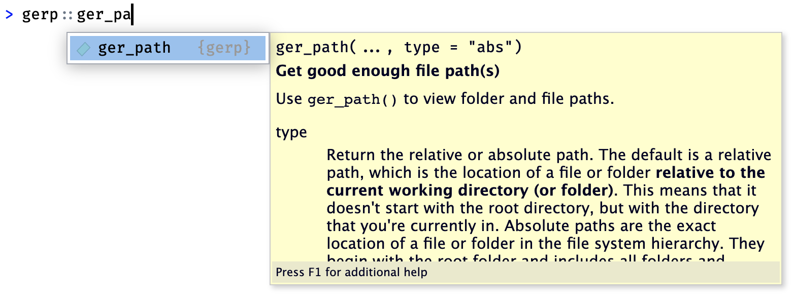

```{r setup, include = FALSE}
knitr::opts_chunk$set(
  collapse = TRUE,
  comment = "#>", 
  eval = FALSE
)
```


<!--
[ChatGPT](https://www.wikiwand.com/en/ChatGPT): 'how to I start learning R?'

> *Great question! R is a popular programming language that is widely used for data analysis and statistical computing. Here are some steps to get started learning R:*
>
> -   ***Install R:** The first step is to download and install R on your computer. You can download R for free from the Comprehensive R Archive Network (CRAN) website.*
>
>
> -   ***Install RStudio**: RStudio is a popular integrated development environment (IDE) for R. It provides a user-friendly interface and makes it easy to write and run R code. You can download RStudio for free from their website.*
>
> -   ***Learn the basics**: Once you have installed R and RStudio, it's time to start learning the basics of R. You can start by learning about data types, variables, functions, and basic programming concepts like loops and conditionals.*
>
> -   ***Practice coding**: The best way to learn R is by practicing coding. Try to write small programs to solve simple problems. You can find practice problems and coding challenges online or in books.*
>
> -   ***Learn data analysis**: R is widely used for data analysis, so it's important to learn how to use R for data manipulation, cleaning, and visualization. There are many online resources and courses that can help you learn these skills.*
>
> -   ***Join the R community**: There is a large community of R users and developers online. You can join forums, attend meetups, and follow blogs and social media accounts to learn from other R users and get help with your coding questions.*
>
> *Remember, learning R takes time and practice, so don't get discouraged if you don't understand everything at once. Just keep practicing and you'll get better over time!*

-->

A [Google search](https://bfy.tw/Tx85) for the question above will return a deluge of websites, tutorials, YouTube videos and blog posts. The results probably aren't incorrect, but they're not likely to contain any practices or habits new R users should adopt when beginning their R journey. `gerp` was written to help guide new users towards a set of ‘good enough’ practices that have been shown to help "[*you get more done in less time and with less pain.*](https://journals.plos.org/ploscompbiol/article?id=10.1371/journal.pcbi.1005510#sec028)*"*[1] New R users often struggle to find these habits because they aren’t typically covered in textbooks or online documentation (with some great exceptions[2]), but adopting at least a few of these practices will increase your productivity when you’re using R (and your computer in general!).


This vignette will go over how to install and load the `gerp` package, navigating your computers folders and files, and how to get started with a new `gerp` R project.

> ***Practice (prăk′tĭs)***
> 
> *To do or perform habitually or customarily; make a habit of*

One of the first practices we're going to cover is installing and loading packages. R packages are a collection of functions, data, and documentation bundled in a standardized format. R packages are a vital part of the R ecosystem and provide users with a wide range of data analysis, visualization, and modeling tools. Understanding where and how to access them is essential to your early success.

## Install a package

R is an open-source programming language, so anyone can create an R package. These packages are typically shared with other R users through online repositories like the [Comprehensive R Archive Network (CRAN)](https://cran.r-project.org/web/packages/available_packages_by_name.html) or [GitHub](https://github.com/).

Enter the code below in your R console to download the most recent version of `gerp` from GitHub:

```{r eval=FALSE}
install.packages("remotes")
remotes::install_github("mjfrigaard/gerp")
```

## Load a package

After `gerp` is installed, load the package using the `library()` function

```{r eval=FALSE}
library(gerp)
```


# R projects

All R projects inevitably involve creating files, so after installing packages, the next thing to decide is **where my projects will live.** The next practice we'll cover tools and methods for orienting yourself with your computers' folder structure. 

## Folder orientation 

> “*If you don't know where you are going, you'll end up someplace else.*” - [Yogi Berra](https://www.goodreads.com/quotes/23616-if-you-don-t-know-where-you-are-going-you-ll-end)

An operating system folder structure refers to how files and directories (i.e. folders) are organized on a computer's hard drive. Folder structures can vary depending on the specific operating system being used. However, most operating systems have the same basic design, including a hierarchical tree-like arrangement with similar common folders:

-   `Users`/`usr`: user-level programs, utilities, libraries, and documentation

-   `Library`/`lib`: the shared library files that are used by all applications

-   `bin`: holds necessary system binary files and programs 

-   `etc`: contains system configuration files

-   `Home`/`home`: user-specific files and directories

Your computer's operating system folder structure is organized to provide a logical and predictable way of storing and accessing folders and files on a computer. Applications like Windows Explorer and Finder present our computer's folder and file structure in a display we can navigate with our mouse and cursor, but behind the scenes they're accessing the system paths (or locations).

Folder paths typically consist of a series of names that indicate the hierarchical structure of the folder system, separated by a forward slash (`"/"`) or a backslash (`"\"`) (depending on the operating system). In Unix-based systems (like macOS or Linux), the topmost (or *root*) folder is usually represented by a forward slash (`/`). In Windows systems, the root folder is assigned a 'drive letter' followed by a backslash (i.e, `C:\`). If it's a file path, it may also include the file's extension.

For example, a Windows file path might look like this:

***`C:\Users\Username\Documents\file.txt`***

In this case: 

*   `"C:"` represents the computer's hard drive  

*   `"Users"` is a folder name  

*   `"Username"` is the user account folder 

*   `"Documents"` is a sub-folder within that user's home folder, and 

*   `"file.txt"` is the name and extension of the file

Paths provide the exact location of a file or folder in the directory structure of a computer's file system. 

### An example project folder

To keep things simple, let's assume I've chosen to place my R projects in a `projects/` folder. I've created the `projects/` subfolder under my `Users` folder, which I can locate using using Finder (on macOS):

<br>

```{r my-projects, echo=FALSE, eval=TRUE, out.width='70%', fig.align='center', fig.cap='folder structure on macOS'}
knitr::include_graphics("../man/figures/my-projects.png")
```

<br>

If I'm using a Windows system, a similar `Projects/` folder might look like this in the Windows Explorer:

<br>

```{r my-folders-win, echo=FALSE, eval=TRUE, out.width='50%', fig.align='center', fig.cap='folder structure on Windows'}
knitr::include_graphics("../man/figures/my-folders-win.png")
```

### RStudio's default working directory

When I open RStudio (on a PC), the **Files** pane is set to my `User` folder (image below), but it's displaying more folders than Windows Explorer (image above):

<br>

```{r home-win, echo=FALSE, eval=TRUE, out.width='70%', fig.align='center', fig.cap='Home folder RStudio (macOS)'}
knitr::include_graphics("../man/figures/rstudio-files-pane-win.png")
```

<br>

These different displays can be confusing, which is it's better to think of file and folder paths as a location on map--one digit off and you'll end up in wrong place. However, I can confirm my location by checking the folder path in the **Files** pane above the folders: 

<br>

```{r rstudio-files-path-win, echo=FALSE, eval=TRUE, out.width='95%', fig.align='center', fig.cap='Directory path (Windows)'}
knitr::include_graphics("../man/figures/rstudio-files-path-win.png")
```

<br>

The folder RStudio initially displays in the **Files** pane is called the *default working directory*, and it's configured when you [install RStudio](https://rstudio-education.github.io/hopr/starting.html). If you'd like to change it, you can by clicking on **Tools** > **Global Options** then **Browse** to the folder you'd like to use: 

<br>

```{r new-default-wd.png, echo=FALSE, eval=TRUE, out.width='95%', fig.align='center', fig.cap='Change default working directory'}

```

## Folder navigation 

R comes with a helpful function for printing our current working directory (or folder) path: `getwd()`.

On macOS, if I check my working directory, I see it's my user account folder:  

```{r getwd, eval=FALSE}
getwd()
[1] "/Users/mjfrigaard"
```

Three other helpful functions for viewing your computers' folders and files are: `dir()`, `list.files()`, and `list.dirs()`. I'll focus on `dir()`, but the other two function in a similar way. Passing `dir()` directly to the console (with no other arguments) returns the list of folders in the default working directory:

```{r dir, eval=FALSE}
dir()
 [1] "Applications"         "Creative Cloud Files" "Desktop"             
 [4] "digital-id"           "Documents"            "Downloads"           
 [7] "Dropbox"              "Fonts"                "Library"             
[10] "Movies"               "Music"                "opt"             
[13] "Pictures"             "projects"             "Public"
[16] "R"                    "Themes"
```

If we add the `full.names = TRUE` argument, we see the full path to the files and folders: 
```{r dir-full.names, eval=FALSE}
dir(full.names = TRUE)
 [1] "./Applications"         "./Creative Cloud Files" "./Desktop"             
 [4] "./digital-id"           "./Documents"            "./Downloads"           
 [7] "./Dropbox"              "./Fonts"                "./Library"             
[10] "./Movies"               "./Music"                "./opt"             
[13] "./Pictures"             "./projects"             "./Public"
[16] "./R"                    "./Themes"
```

Adding the `full.names` returned the folders and files in the working directory, but added a `./` prefix. In computer file systems, `"."` and `".."` are special directory (i.e., folder) names that have specific meanings. `"."` represents the current folder, and `".."` represents the parent folder in a file path. These directory names are used to specify relative paths to other files and directories in the file system.

### Folder trees

[folder tree's](https://www.wikiwand.com/en/Directory_structure) are handy tools for navigating a computer's folder structure. As noted above, operating systems organize folders and files in a hierarchical, tree-like arrangement, with a single root directory (or folder) at the top, and sub-folders branching off from it. Each folder can contain files and additional subfolders and, in turn, can have more files and subfolders.

We'll use folder trees to describe the special directories implied by `"."` and `".."`: 

- 	`"."` represents the current folder and refers to the folder the user is currently in. For example, if I am in the folder `"/user/jdoe/documents"`, the folder tree would look like this: 

    ```{bash, eval = FALSE}
    users/
      └── jdoe/
            └── documents/ <- my location
    ```

    -   In this case, `"."` refers to same location (`"/user/jdoe/documents"`)
    
    ```{bash, eval = FALSE}
    users/
      └── jdoe/
            └── documents/ -> "." also my location
    ```
    

-	`".."` (dot dot) represents the *parent* folder. It is used to refer to the folder that contains the current folder. For example, if I am in the folder `"/user/jdoe/documents"`

    ```{bash, eval = FALSE}
    users/
      └── jdoe/
            └── documents/ <- my location
    ```

    -   Then `".."` refers to `"/user/jdoe"`
    
    ```{bash, eval = FALSE}
    users/
      └── jdoe/ -> ".." parent folder
            └── documents/ 
    ```


## `ger_path()`

The first function we'll cover is one to get comfortable using, `ger_path()`. We've already installed and loaded the `gerp` package, but sometimes handy to explicitly tell R which function we intend to use from a package. We can do this by entering `package::function()`, and you can see why in the image below: 

<br>

```{r namespacing, echo=FALSE, eval=TRUE, out.width='40%', fig.align='center', fig.cap='All functions and objects in gerp'}
knitr::include_graphics("../man/figures/namespacing.png")
```

<br>

Using `package::function()` shows us all the functions and objects in a package. When we select a package item, we can see the documentation in yellow: 

<br>

```{r namespacing-doc, echo=FALSE, eval=TRUE, out.width='80%', fig.align='center', fig.cap='help for ger_path()'}

```

<br>

To use `ger_path()`, start by entering a forward slash enclosed in quotes (`"/"`)

```{r , eval=FALSE}
gerp::ger_path("/")
```

If you hit the **Tab** key, you'll see the list of folders available starting at your home directory. 

<br>

```{r ger_path-home, echo=FALSE, eval=TRUE, out.width='60%', fig.align='center', fig.cap='Home directory (macOS)'}

```

<br>

You can then continue using your mouse (or the arrow keys) to navigate to the parent folder you want your R project to live in (in my case, it's `/Users/mjfrigaard/projects/`)

<br>

```{r ger_path-gif, echo=FALSE, fig.align='center', eval=TRUE, out.width='80%'}
knitr::include_graphics("../man/figures/ger_path.gif")
```

<br>

`ger_path()` works the same way on Windows: 

<br>

```{r ger_path-win-gif, echo=FALSE, fig.align='center', eval=TRUE, out.width='80%'}

```

<br>

The type argument controls whether `ger_path()` returns a relative or absolute folder path:

```{r ger_path-abs, eval=FALSE}
gerp::ger_path("/Users/mjfrigaard/projects/", type = "abs")
[1] "/Users/mjfrigaard/projects"
```

The absolute path returns the complete and specific location of the folder in the file system, starting from the root directory.

```{r ger_path-rel, eval=FALSE}
gerp::ger_path("/Users/mjfrigaard/projects/", type = "rel")
[1] "projects"
```

The relative path refers to the location of the folder relative to the current working folder (i.e., the folder where the user is currently located). 

# Creating a `gerp` project

After locating the R project folder, you can store the output and pass it to `gerp::ger_proj()`

```{r ger_go, eval=FALSE}
pth <- gerp::ger_path("/Users/mjfrigaard/projects/")
gerp::ger_proj(
  folder = pth, 
  name = "my project")
```

and your new 'good enough' project will open in a new session:

```{r my_project.gif, echo=FALSE, eval=TRUE, out.width='100%', fig.align='center', fig.cap='New gerp project!'}
knitr::include_graphics("../man/figures/my_project.gif")
```

**Note**: If you're already using a cloud platform like [Dropbox](https://www.dropbox.com/) or [Google Drive](https://www.google.com/drive/) to keep track of your files, choose a different location for your R project folders. Cloud storage services are great, but they've been known to [cause issues](https://support.posit.co/hc/en-us/articles/200534477) when working with R and RStudio. 

***

1. The name for this package comes from the excellent article, '[Good enough practices in scientific computing](https://journals.plos.org/ploscompbiol/article?id=10.1371/journal.pcbi.1005510)' by Greg Wilson, Jennifer Bryan, Karen Cranston, Justin Kitzes, Lex Nederbragt and Tracy K. Teal

2. Jenny Bryan and Jim Hester address many of these topics in '[What they forgot to teach you about R](https://rstats.wtf/)', and I've codified them into this package wherever I could.
