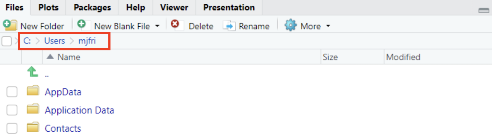
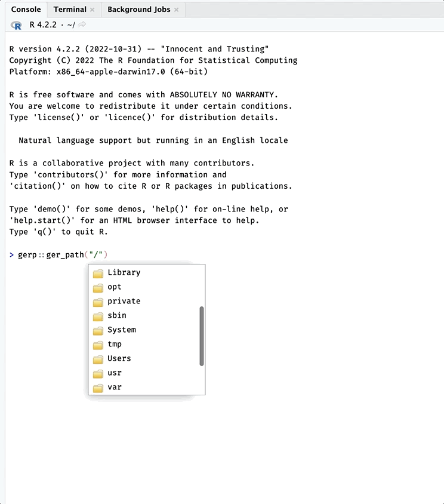

```{r, include = FALSE}
knitr::opts_chunk$set(
  collapse = TRUE,
  comment = "#>"
)
```

```{r setup}
library(gerp)
```

> “*If you don't know where you are going, you'll end up someplace else.*” - [Yogi Berra](https://www.goodreads.com/quotes/23616-if-you-don-t-know-where-you-are-going-you-ll-end)

All R projects inevitably involve creating files on your computer, so it's important to decide **where your R projects will live.** In this vignette, we'll cover some tips and tools for orienting yourself with your computers' folder structure. 

<br>

# Folders 

An operating system folder structure refers to how files and directories (i.e. folders) are organized on a computer's hard drive. Folder structures can vary depending on the specific operating system being used. However, most operating systems have the same basic design, including a hierarchical tree-like arrangement with similar common folders:

-   `Users`/`usr`: user-level programs, utilities, libraries, and documentation

-   `Library`/`lib`: the shared library files that are used by all applications

-   `bin`: holds necessary system binary files and programs 

-   `etc`: contains system configuration files

-   `Home`/`home`: user-specific files and directories

Your computer's operating system folder structure is organized to provide a logical and predictable way of storing and accessing folders and files on a computer. Applications like Windows Explorer and Finder present our computer's folder and file structure in a display we can navigate with our mouse and cursor, but behind the scenes they're accessing the system paths (or locations).

## Folder paths

Folder paths typically consist of a series of names that indicate the hierarchical structure of the folder system, separated by a forward slash (`"/"`) or a backslash (`"\"`) (depending on the operating system). In Unix-based systems (like macOS or Linux), the topmost (or *root*) folder is usually represented by a forward slash (`/`). If it's a file path, it may also include the file's extension.

For example, a Linux or macOS file path might look like this: 

***`usr/home/docs/file.txt`***

In this system: 

*   `"usr"` holds user-related programs, utilities, libraries 

*   `"home"` user-specific files and folders

*   `"docs"` is a sub-folder within that user's home folder, and

*   `"file.txt"` is the name and extension of a file

In Windows systems, the root folder is assigned a 'drive letter' followed by a backslash (i.e, `C:\`). 

An example Windows file path might look like this:

***`C:\Users\Username\Documents\file.txt`***

In this case: 

*   `"C:"` represents the computer's hard drive  

*   `"Users"` is a folder name  

*   `"Username"` is the user account folder 

*   `"Documents"` is a sub-folder within that user's home folder, and 

*   `"file.txt"` is the name and extension of the file

As you can see from the two examples above, file paths provide the exact location of a file or folder in the directory structure of a computer's file system. 

### An example project folder (macOS)

Let's assume I've created a `projects/` folder for my new R projects. This new `projects/` folder is a subfolder under my `Users` folder, which I can locate using using Finder (on macOS):

<br>

```{r my-projects, echo=FALSE, eval=TRUE, out.width='70%', fig.align='center', fig.cap='folder structure on macOS'}
knitr::include_graphics("../man/figures/my-projects.png")
```

<br>

The path for this folder would be: 

```bash
/Users/mjfrigaard/projects/
```

<br>

### An example project folder (Windows)

If I'm using a Windows system, a similar `Projects/` folder might look like this in the Windows Explorer:

<br>

```{r my-folders-win, echo=FALSE, eval=TRUE, out.width='50%', fig.align='center', fig.cap='folder structure on Windows'}
knitr::include_graphics("../man/figures/my-folders-win.png")
```

<br>

The path for this folder would be: 

```bash
C:\Users\mjfri\Projects\
```

<br>

## RStudio's default working directory

A new RStudio session opens with the **Files** pane set to my `User` folder. You might notice the image below is displaying more folders than Windows Explorer image above:

<br>

```{r home-win, echo=FALSE, eval=TRUE, out.width='70%', fig.align='center', fig.cap='Home folder RStudio (PC)'}
knitr::include_graphics("../man/figures/rstudio-files-pane-win.png")
```

<br>

These different displays can be confusing, but it's only because Windows Explorer hides some of the System folders you don't regularly need to access.

<br>

<!-- I like to think of file and folder paths like a location on map--a single incorrect character or digit in the address and you'll end up in wrong place.-->

Fortunately, RStudio helps me confirm my location by displaying the folder path in the **Files** pane above the folders:  

<br>

```{r rstudio-files-path-win, echo=FALSE, eval=TRUE, out.width='95%', fig.align='center', fig.cap='Default working directory (Windows)'}

```

<br>

The folder RStudio initially displays in the **Files** pane is called the *default working directory*, and it's configured when you [install RStudio](https://rstudio-education.github.io/hopr/starting.html). If you'd like to change it, you can by clicking on **Tools** > **Global Options** then **Browse** to the folder you'd like to use: 

<br>

```{r new-default-wd.png, echo=FALSE, eval=TRUE, out.width='95%', fig.align='center', fig.cap='Change default working directory'}
knitr::include_graphics("../man/figures/new-default-wd.png")
```

## Folder navigation in R

R comes with a helpful function for printing our current working directory (or folder) path: `getwd()`.

On macOS, if I check my working directory, I see it's my user account folder:  

```{r getwd, eval=FALSE}
getwd()
[1] "/Users/mjfrigaard"
```

The three other functions to help view your computers' folders and files are:

1. `dir()`  
2. `list.files()`  
3. `list.dirs()`

I'll focus on `dir()`, but the other two work in a similar way. 

### Listing folders 

Passing `dir()` directly to the console (with no other arguments) returns the list of folders in the default working directory:

```{r dir, eval=FALSE}
dir()
 [1] "Applications"        
 [2] "Creative Cloud Files"
 [3] "Desktop"             
 [4] "Documents"           
 [5] "Downloads"           
 [6] "Dropbox"             
 [7] "Fonts"               
 [8] "Library"             
 [9] "Movies"              
[10] "Music"               
[11] "Pictures"            
[12] "projects"            
[13] "Public"              
[14] "R"                   
[15] "Themes"
```

If we add the `full.names = TRUE` argument, we see the full path to the folders: 

```{r dir-full.names, eval=FALSE}
dir(full.names = TRUE)
 [1] "./Applications"        
 [2] "./Creative Cloud Files"
 [3] "./Desktop"             
 [4] "./Documents"           
 [5] "./Downloads"           
 [6] "./Dropbox"             
 [7] "./Fonts"               
 [8] "./Library"             
 [9] "./Movies"              
[10] "./Music"               
[11] "./Pictures"            
[12] "./projects"            
[13] "./Public"              
[14] "./R"                   
[15] "./Themes"
```

On a PC, `dir(full.names = TRUE)` might look like this: 

```{r dir-PC, eval=FALSE}
 dir(full.names = TRUE)
 [1] "./AppData"                                                             
 [2] "./Application Data"                                                   
 [3] "./Contacts"                                                           
 [4] "./Cookies"                                                             
 [5] "./Desktop"                                                             
 [6] "./Documents"                                                           
 [7] "./Downloads"                                                           
 [8] "./Dropbox"                                                             
 [9] "./Favorites"                                                           
[10] "./IntelGraphicsProfiles"                                               
[11] "./Links"                                                               
[12] "./Local Settings"                                                     
[13] "./Music"                                                               
[14] "./My Documents"                                                       
[15] "./NetHood"                                                             
[16] "./NTUSER.DAT"                                                         
[17] "./OneDrive"                                                           
[18] "./Pictures"                                                           
[19] "./PrintHood"                                                           
[20] "./Projects"                                                           
[21] "./Recent"                                                             
[22] "./Searches"                                                           
[23] "./SendTo"                                                             
[24] "./Start Menu"                                                         
[25] "./Templates"                                                           
[26] "./Videos" 
```

Adding the `full.names` returned the folders in the working directory and added a `./` prefix. In computer file systems, `"."` and `".."` are special directories (i.e., folders) that have specific meanings. 

- `"."` represents the current folder 

- `".."` represents the parent folder in a file path

These directory names are used to specify relative paths to other files and directories in the file system.

### Folder trees

[Folder tree's](https://www.wikiwand.com/en/Directory_structure) are text displays of a computer's folder structure. As noted above, all operating systems organize folders and files in a hierarchical, tree-like arrangement, with a single root folder (or directory) at the top, and sub-folders branching off below. Each folder can contain files and additional subfolders and, in turn, can have more files and subfolders.

<br>

```{bash, eval=FALSE}
root/
  └── folder/
        └── subfolder/
```

<br>

We'll use folder trees to describe the special directories implied by `"."` and `".."`: 

<br>

- 	`"."` represents the current folder the user is currently in. For example, if I am in the folder `"/user/jdoe/documents"`, the folder tree would look like this: 

    ```{bash, eval = FALSE}
    users/
      └── jdoe/
            └── documents/ <- my location
    ```

    -   In this case, `"."` refers to same location (`"/user/jdoe/documents"`)
    
    ```{bash, eval = FALSE}
    users/
      └── jdoe/
            └── documents/ -> "." also my location
    ```
    

-	`".."` (dot dot) represents the *parent* folder. `..` is used to refer to the folder that *contains* the current folder. For example, if I am in the folder `"/user/jdoe/documents"`

    ```{bash, eval = FALSE}
    users/
      └── jdoe/
            └── documents/ <- my location
    ```

    -   Then `".."` refers to `"/user/jdoe"`
    
    ```{bash, eval = FALSE}
    users/
      └── jdoe/ -> ".." parent folder
            └── documents/ 
    ```


## Path functions

`gerp` has three functions designed to help you become familiar with folder paths: `ger_path()`, `ger_root()`, and `ger_fpath()`

First we'll cover `ger_path()`, because it comes in handy when you're setting up a new `gerp` project. 

### `ger_path()`

We've already installed and loaded the `gerp` package, but sometimes handy to explicitly tell R which function we intend to use from a package. We can do this by entering `package::function()`, and you can see why in the image below: 

<br>

```{r namespacing, echo=FALSE, eval=TRUE, out.width='40%', fig.align='center', fig.cap='All functions and objects in gerp'}
knitr::include_graphics("../man/figures/namespacing.png")
```

<br>

Using `package::function()` shows us all the functions and objects in a package. When we select a package item, we can see the documentation in yellow: 

<br>

```{r namespacing-doc, echo=FALSE, eval=TRUE, out.width='80%', fig.align='center', fig.cap='help for ger_path()'}
knitr::include_graphics("../man/figures/namespacing-doc.png")
```

<br>

To use `ger_path()`, start by entering a forward slash enclosed in quotes (`"/"`)

```{r , eval=FALSE}
gerp::ger_path("/")
```

If you hit the **Tab** key, you'll see the list of folders available starting at your home directory. 

<br>

```{r ger_path-home, echo=FALSE, eval=TRUE, out.width='60%', fig.align='center', fig.cap='Home directory (macOS)'}
knitr::include_graphics("../man/figures/ger_path-home.png")
```

<br>

You can then continue using your mouse (or the arrow keys) to navigate to the parent folder you want your R project to live in (in my case, it's `/Users/mjfrigaard/projects/`)

<br>

```{r ger_path-gif, echo=FALSE, fig.align='center', eval=TRUE, out.width='80%'}

```

<br>

`ger_path()` works the same way on Windows: 

<br>

```{r ger_path-win-gif, echo=FALSE, fig.align='center', eval=TRUE, out.width='80%'}
knitr::include_graphics("../man/figures/ger_path-win.gif")
```

<br>

### Absolute vs. relative paths

The `type` argument controls whether `gerp::ger_path()` returns a relative or absolute folder path. An absolute path returns the complete and specific location of the folder in the file system, starting from the root directory.

```{r ger_path-abs, eval=FALSE}
gerp::ger_path("/Users/mjfrigaard/projects/", type = "abs")
[1] "/Users/mjfrigaard/projects"
```

A relative path refers to the location of the folder relative to the current working folder (i.e., the folder where the user is currently located). 

```{r ger_path-rel, eval=FALSE}
gerp::ger_path("/Users/mjfrigaard/projects/", type = "rel")
[1] "projects"
```

### Return a `tree`

If you'd like to see a folder tree for the path in `gerp::ger_path()`, you can set `tree` to `TRUE`

```{r ger_path-tree, eval=FALSE}
gerp::ger_path("/Users/mjfrigaard/projects/", tree = TRUE)
/Users/mjfrigaard/projects
├── apps
├── blogs
├── dev
├── methods
└── pkgs
```

### `ger_root()`

The `ger_root()` function will return the 'root' folder path for your project. This comes in handy if you're looking for a certain file. 

```{r ger_root, eval=FALSE}
ger_root()
/Users/mjfrigaard/projects/pkgs/gerp
```

```{r ger_root_tree, eval=FALSE}
ger_root(tree = TRUE)
/Users/mjfrigaard/projects/pkgs/gerp
├── DESCRIPTION
├── LICENSE
├── LICENSE.md
├── NAMESPACE
├── NEWS.md
├── R
├── README.Rmd
├── README.md
├── _dev.R
├── _pkgdown.yml
├── data
├── data-raw
├── docs
├── gerp.Rproj
├── inst
├── man
├── ref
└── vignettes
```


### `ger_fpath()`

`ger_fpath()` will return path to the current file in the **Source** pane.

```{r ger_fpath, eval=FALSE}
ger_fpath()
/Users/mjfrigaard/projects/pkgs/gerp/vignettes/paths.Rmd
```

If `tree` is set to `TRUE`, a folder tree is returned:

```{r ger_fpath_tree, eval=FALSE}
ger_fpath(tree = TRUE)
/Users/mjfrigaard/projects/pkgs/gerp/vignettes
└── paths.Rmd
```


### `ger_lkp_path()`

`ger_lkp_path()` will return the folder tree (or trees) of the provided file or folder to `x`:

```{r ger_lkp_path_dir, eval=FALSE}
# check for inst/ folder
gerp::ger_lkp_path("inst")
/Users/mjfrigaard/projects/pkgs/gerp
└── inst
```

```{r ger_lkp_path_dirs, eval=FALSE}
# check for README.Rmd files
gerp::ger_lkp_path(x = "README.Rmd")
/Users/mjfrigaard/projects/pkgs/gerp
└── README.Rmd
/Users/mjfrigaard/projects/pkgs/gerp/inst/rmarkdown/templates/gerp-README
└── README.Rmd
```


***

1. The name for this package comes from the excellent article, '[Good enough practices in scientific computing](https://journals.plos.org/ploscompbiol/article?id=10.1371/journal.pcbi.1005510)' by Greg Wilson, Jennifer Bryan, Karen Cranston, Justin Kitzes, Lex Nederbragt and Tracy K. Teal

2. Jenny Bryan and Jim Hester address many of these topics in '[What they forgot to teach you about R](https://rstats.wtf/)', and I've codified them into this package wherever I could.
