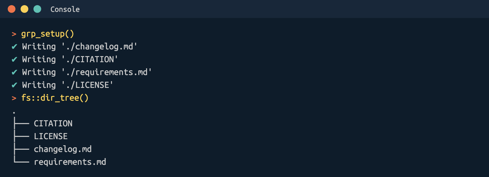

```{r, include = FALSE}
knitr::opts_chunk$set(
  collapse = TRUE,
  comment = "#>"
)
```

```{r setup}
library(gerp)
```

# `grp_setup()`

For quick setup, run the `grp_setup()` function to create `changelog.md`, `LICENSE`, `CITATION` and `requirements.md` files.

```{r grp_setup, echo=FALSE, eval=TRUE, out.width='100%'}

```
