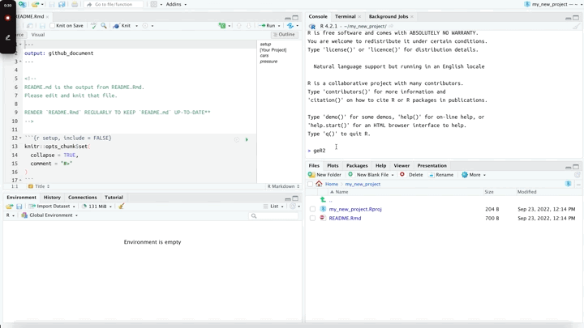

```{r, include = FALSE}
knitr::opts_chunk$set(
  collapse = TRUE,
  comment = "#>"
)
```

```{r setup}
library(gerp)
```

# `ger_setup()`

For quick setup, run the `ger_setup()` function to create `code/`, `data/`, and `ref/` folders.

```{r gerp-setup, echo=FALSE, eval=TRUE, out.width='100%'}

```
